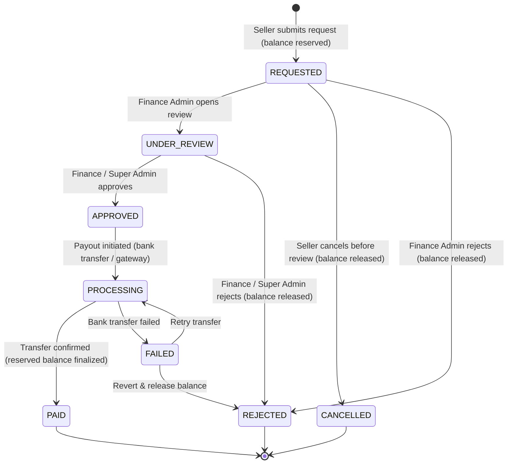

# Specification Mining Report: Phase 6 (Seller Revenue)

**Agent**: `phase6_spec_miner_1`  
**Milestone**: Phase 6 — Seller Revenue  
**Date**: 2026-09-15  
**Source Authorities**:
- `/home/trung/Documents/2026/project/test-v6/PLAN.md` (§5.5, §5.6, §6.2, §6.3, §11.1, §11.2, §18, §19, §21, §22, §27, §30, §31, §32, FR-31, FR-32, FLOW-U12, FLOW-U13, FLOW-U15, BR-01, BR-02, BR-03, BR-07)
- `/home/trung/Documents/2026/project/test-v6/docs/ARCHITECTURE.md`
- `/home/trung/Documents/2026/project/test-v6/docs/decisions/` (0002-money-write-layer.md, 0005-financial-state-machine.md, 0008-role-model.md)
- `/home/trung/Documents/2026/project/test-v6/docs/threat-model.md` (Threat T7 Withdrawal Race)
- `/home/trung/Documents/2026/project/test-v6/docs/api-conventions.md`
- `/home/trung/Documents/2026/project/test-v6/.agents/ORIGINAL_REQUEST.md` (§Phase 6)
- Existing Codebase: `web/src/services/purchase.ts`, `web/src/services/wallet.ts`, `web/src/collections/OrderItems/`, `web/src/collections/Orders/`, `web/src/collections/Wallets.ts`, `web/src/collections/WalletLedger.ts`, `web/src/collections/SellerProfiles.ts`, `web/src/access/`

---

## Executive Summary

Phase 6 ("Seller Revenue") implements the monetization and payout layer of KienTaoHub:
1. **Commission Calculation & Seller Earnings**: Calculates platform fee and seller earnings during order completion using a 3-tier hierarchy (campaign -> seller override -> site default), stores snapshot splits in `order_items`, and creates `seller_earnings` with a `PENDING` hold period (default 7 days) before transitioning to `AVAILABLE`.
2. **Withdrawal Request & Approval Workflow**: Enables sellers to request bank payouts against their `AVAILABLE` balance, atomistically reserves balances to prevent withdrawal race conditions (Threat T7), routes requests through a strict 8-state machine (`REQUESTED` -> `UNDER_REVIEW` -> `APPROVED` -> `PROCESSING` -> `PAID`; `REJECTED`, `CANCELLED`, `FAILED`), releases reserved balances upon rejection/cancellation, restricts approvals to `financeAdmin` and `admin`, and writes immutable transition audit logs to `withdrawal_events`.
3. **Refunds via Compensating Ledger Entries**: Complies with BR-03 and Decision 0002 (immutable financial ledger). Never mutates or deletes existing ledger entries; instead generates compensating reversal entries in `wallet_ledger`, reverses seller earnings and platform fees, transitions order status to `REFUNDED` / `PARTIALLY_REFUNDED`, revokes buyer entitlements, and records audit logs.
4. **Finance Operations & Seller Dashboard**: Provides dedicated REST endpoints under `/api/v1/seller/` and `/api/v1/admin/` and powers the `/seller` dashboard with gross sales, platform fees, pending hold, available balance, and withdrawal history.

---

## Features Discovered

| # | Category | Feature | Description | Inputs | Outputs | Error Behavior | Discovered Via |
|---|----------|---------|-------------|--------|---------|----------------|----------------|
| 1 | Commission | 3-Tier Hierarchy Rate Resolution | Resolves applicable commission rate using hierarchy: (1) Active Campaign Rate, (2) Per-Seller Override Rate, (3) Site-Wide Default Rate | `sellerId`, `productId`, `campaignContext` | Resolved `commissionRate` (e.g. 0.30) & `policyVersion` (e.g. `v1-default`) | Fallback to site default (0.30 / 30%) if overrides absent | PLAN.md §6.3, ORIGINAL_REQUEST.md line 92 |
| 2 | Commission | Atomic Fee & Split Calculation | Calculates `platformFee = Math.round(salePrice * commissionRate)` and `sellerAmount = salePrice - platformFee - tax` in integer VND | `salePrice` (integer VND), `commissionRate` (float 0..1), `tax` (default 0) | `{ platformFee, sellerAmount, tax }` | Invariant violation if `platformFee + sellerAmount + tax !== salePrice` | PLAN.md §6.2, §6.3, ORIGINAL_REQUEST.md line 90-93 |
| 3 | Commission | BR-07 Snapshot Line Items | Populates and freezes `salePrice`, `platformFee`, `sellerAmount`, `tax`, `policyVersion` in `order_items` during `purchaseProduct` | Purchase transaction data | Persisted immutable `order_items` document | Updates blocked by `preventOrderItemMutation` hook | PLAN.md BR-07, `OrderItems/index.ts`, `purchase.ts` |
| 4 | Earnings | Seller Earning Record Creation | Creates `seller_earnings` record with status `PENDING` atomically inside the purchase transaction | `sellerId`, `orderId`, `orderItemId`, `productId`, `sellerAmount`, `holdDays` | `seller_earnings` doc (`status: 'PENDING'`, `holdUntil: NOW + holdDays`) | Fails purchase transaction if earning record creation fails | PLAN.md FR-31, FLOW-U03, FLOW-U12 |
| 5 | Earnings | Hold Period Maturation | Transitions `seller_earnings` from `PENDING` to `AVAILABLE` once `NOW() >= holdUntil` (configurable, default 7 days) | `earningId` or scheduled/lazy query | Updated status `AVAILABLE`, `availableAt: NOW()` | No-op if hold period has not expired or status already `AVAILABLE`/`REFUNDED` | PLAN.md FR-31, ORIGINAL_REQUEST.md line 95 |
| 6 | Earnings | Seller Available Balance Computation | Aggregates withdrawable funds: `sum(AVAILABLE earnings) - sum(active reserved withdrawals)` | `sellerId` | `availableBalance` (integer VND), `pendingBalance` (integer VND) | 0 if no available earnings | PLAN.md FR-31, FR-32, FLOW-U13 |
| 7 | Withdrawal | Withdrawal Request Submission | Seller requests withdrawal of available earnings to a Vietnamese bank account | `amount`, `bankName`, `accountNumber`, `accountHolderName` | Created `withdrawals` doc (`status: 'REQUESTED'`), reserved balance | Rejects if `amount <= 0`, `amount > availableBalance`, or limits violated | PLAN.md FR-32, FLOW-U13, ORIGINAL_REQUEST.md line 100-105 |
| 8 | Withdrawal | Min/Max Limits Validation | Validates requested amount against platform thresholds (e.g. min 50,000 VND, max 50,000,000 VND) | `amount` | Validated amount | `WITHDRAWAL_MIN_LIMIT_NOT_MET` / `WITHDRAWAL_MAX_LIMIT_EXCEEDED` (400) | PLAN.md FR-32, ORIGINAL_REQUEST.md line 103 |
| 9 | Withdrawal | Balance Reservation (Anti-Race T7) | Atomically reserves requested amount to prevent race conditions / double-spend across concurrent requests | `sellerId`, `amount`, `withdrawalId` | Deducted available balance, updated pending/reserved total | Fails request if balance becomes insufficient during atomic update | PLAN.md BR-01, §32 Threat T7, `docs/threat-model.md` |
| 10 | Withdrawal | State Machine Transitions | Governs withdrawal lifecycle: `REQUESTED -> UNDER_REVIEW -> APPROVED -> PROCESSING -> PAID` | `withdrawalId`, `targetStatus`, `actorId`, `notes` | Updated withdrawal status | Rejects illegal transitions (e.g. from `PAID` or `REJECTED`) with 400 | PLAN.md FR-32, Decision 0005 |
| 11 | Withdrawal | Balance Release on Rejection/Cancellation | Releases reserved balance back to seller available balance when withdrawal is `REJECTED` or `CANCELLED` | `withdrawalId`, `reason` | Status `REJECTED`/`CANCELLED`, reserved amount restored | Rejects if status is already terminal or balance already released | PLAN.md FR-32, FLOW-U13, ORIGINAL_REQUEST.md line 107 |
| 12 | Withdrawal | Authorization Matrix Enforcement | Restricts approval/rejection to Finance Admin (`financeAdmin`) and Super Admin (`admin`); sellers only see/request own | `req.user`, `action` | Authorized action | 403 Forbidden for Buyer, Seller, Moderator attempting review/approve | PLAN.md §5.5, §22, Decision 0008 |
| 13 | Withdrawal | Audit Logging (`withdrawal_events`) | Immutable audit trail for every status change, recording actor, role, previous status, new status, timestamp, reason | `withdrawalId`, `fromStatus`, `toStatus`, `actor`, `actorRole`, `reason`, `metadata` | New `withdrawal_events` record | Fails the state transition if audit write fails | PLAN.md FR-32, §NFR-14 |
| 14 | Refund | Compensating Ledger Credit (Buyer) | Injects reversal credit entry in `wallet_ledger` for buyer wallet without mutating original purchase record | `buyerId`, `amount`, `orderCode`, `refundReason` | Reversal `wallet_ledger` entry (`type: 'refund'`, `direction: 'credit'`), buyer balance credited | Fails if buyer wallet is frozen or database write fails | PLAN.md BR-03, FLOW-U15, Decision 0002 |
| 15 | Refund | Seller Earning Reversal | Reverses seller earning: if `PENDING`, marks cancelled/refunded; if `AVAILABLE`, deducts from seller balance | `earningId` / `orderId`, `refundAmount` | `seller_earnings` updated/marked `REFUNDED` | Handles deficit per loss-absorption policy if seller balance < refund | PLAN.md FLOW-U15, Decision 0005 T7 |
| 16 | Refund | Platform Fee Reversal | Reverses platform revenue associated with the refunded order item | `orderItemId`, `platformFee` | Recorded platform fee reversal in refund metadata / ledger | Logged in refund record | PLAN.md FLOW-U15 |
| 17 | Refund | Order Status Update | Updates order status to `REFUNDED` (or `PARTIALLY_REFUNDED`) while preserving snapshot line items | `orderId`, `refundStatus` | `orders.status = 'REFUNDED'` | Rejects if order is already refunded (anti-duplicate) | PLAN.md line 662-663, line 1355, 3014 |
| 18 | Refund | Entitlement Revocation | Revokes active entitlement (`entitlements.status = 'revoked'`) so buyer can no longer generate download tokens | `orderId`, `buyerId`, `productId` | `entitlements.status = 'revoked'` | Logged; handles case where policy permits retained access | PLAN.md FLOW-U15 step H, line 3017 |
| 19 | Refund | Audit Log & Refund Record | Creates `refunds` record capturing buyer, seller, order, amount, actor, reason, timestamps | `orderId`, `amount`, `reason`, `actorId` | Created `refunds` record | Fails refund transaction if logging fails | PLAN.md FLOW-U15, §5.5, §22 |
| 20 | Finance Admin | `GET /api/v1/seller/earnings` | Returns earnings breakdown, pending hold total, available balance, and itemized history for the authenticated seller | Authenticated seller session, pagination params | `{ totalEarned, pendingBalance, availableBalance, earnings: [...] }` | 401 Unauthenticated, 403 Non-seller | PLAN.md §18, ORIGINAL_REQUEST.md line 123 |
| 21 | Finance Admin | `POST /api/v1/seller/withdrawals` | Seller endpoint to request payout to bank account | `{ amount, bankName, accountNumber, accountHolderName }` | 201 Created with withdrawal details & status `REQUESTED` | 400 Insufficient funds / invalid params | PLAN.md §18, FR-32 |
| 22 | Finance Admin | `GET /api/v1/admin/withdrawals` | Finance Admin endpoint to list all withdrawal requests across all sellers with status and date filtering | Filter params (`status`, `sellerId`, `page`, `limit`) | Paginated withdrawal records with seller info and event history | 403 Non-finance/admin | PLAN.md §18, §22 |
| 23 | Finance Admin | `POST /api/v1/admin/withdrawals/{id}/approve` | Finance Admin endpoint to approve a withdrawal request (`UNDER_REVIEW` -> `APPROVED`) | `id` (withdrawal ID), optional `notes` | Updated withdrawal object (`status: 'APPROVED'`) | 400 Invalid transition, 403 Non-finance/admin, 404 Not found | PLAN.md §18, §22 |
| 24 | Finance Admin | `POST /api/v1/admin/withdrawals/{id}/reject` | Finance Admin endpoint to reject a withdrawal and release reserved balance | `id`, mandatory `reason` | Updated withdrawal object (`status: 'REJECTED'`), balance released | 400 Missing reason / invalid state, 403 Non-finance/admin | PLAN.md §18, FR-32, FLOW-U13 |
| 25 | Finance Admin | `POST /api/v1/admin/refunds` | Finance Admin endpoint to execute compensating refund for an order | `{ orderId, reason, revokeEntitlement?: boolean }` | Refund result object, compensating ledger ID, updated order | 400 Already refunded / invalid order, 403 Non-finance/admin | PLAN.md §18, §22, FLOW-U15 |
| 26 | Seller Portal | Seller Dashboard (`/seller`) Views | UI dashboard rendering financial overview cards, earnings list, withdrawal request form, and payout history | Authenticated seller session | HTML/React Dashboard view | Redirect to login or 403 if unauthorized | PLAN.md §18, ORIGINAL_REQUEST.md line 122 |

---

## Edge Cases

| # | Feature | Input | Observed / Required Behavior |
|---|---------|-------|------------------------------|
| E1 | Commission Rounding | `salePrice = 199,000 VND`, `rate = 0.30` (30%) | `platformFee = Math.round(199000 * 0.30) = 59,700 VND`. `sellerAmount = 199000 - 59700 = 139,300 VND`. Invariant checked: `59700 + 139300 = 199000 VND`. Exactly 0 remainder. |
| E2 | Commission Rounding Fractional VND | `salePrice = 100,001 VND`, `rate = 0.30` (30%) | `100001 * 0.30 = 30000.3`. `platformFee = Math.round(30000.3) = 30,000 VND`. `sellerAmount = 100001 - 30000 = 70,001 VND`. Conservation holds: `30000 + 70001 = 100001 VND`. Stored as integers. |
| E3 | Free Products (0 VND) | `salePrice = 0 VND`, `isFree = true` | `platformFee = 0 VND`, `sellerAmount = 0 VND`. `seller_earnings` is either omitted or recorded with 0 VND amount and immediately marked `AVAILABLE` (no hold required for free goods). |
| E4 | Historical Rate Change (BR-07) | Platform changes default commission from 30% to 20% on 2026-10-01 | Past `order_items` and `seller_earnings` created before 2026-10-01 retain their exact historical snapshot fees (30%). Only orders created after the policy update receive 20%. |
| E5 | Withdrawal Concurrent Overdraft (T7) | Seller available balance = 500,000 VND. Seller fires two simultaneous withdrawal requests of 400,000 VND each | Atomic row lock or conditional update (`UPDATE seller_balances SET available = available - 400000 WHERE available >= 400000`). First request succeeds (`available = 100,000 VND`, `reserved = 400,000 VND`). Second request fails with `INSUFFICIENT_AVAILABLE_BALANCE` (400). No negative balance! |
| E6 | Withdrawal Exact Available Balance | Available balance = 1,000,000 VND. Seller requests withdrawal of 1,000,000 VND | Request succeeds. `availableBalance` becomes 0 VND. `reserved` becomes 1,000,000 VND. Status `REQUESTED`. |
| E7 | Withdrawal Amount Below Min Limit | Platform min withdrawal = 50,000 VND. Seller requests 20,000 VND | Rejected with `WITHDRAWAL_MIN_LIMIT_NOT_MET` (400). No balance reserved. |
| E8 | Withdrawal Amount Above Max Limit | Platform max withdrawal = 50,000,000 VND. Seller requests 60,000,000 VND | Rejected with `WITHDRAWAL_MAX_LIMIT_EXCEEDED` (400). No balance reserved. |
| E9 | Withdrawal Rejection Balance Restoration | Withdrawal of 500,000 VND in `UNDER_REVIEW` is rejected by Finance Admin with reason "Invalid bank account holder name" | Withdrawal transitions to `REJECTED`. 500,000 VND is immediately unreserved and restored to seller's `availableBalance`. `withdrawal_events` logs rejection reason and actor ID. |
| E10 | Withdrawal Cancellation by Seller | Withdrawal of 300,000 VND in `REQUESTED` is cancelled by seller | Withdrawal transitions to `CANCELLED`. 300,000 VND is unreserved and restored to `availableBalance`. `withdrawal_events` logs seller cancellation. |
| E11 | Illegal State Transition Attempt | Seller attempts to cancel withdrawal already in `PROCESSING` or `PAID` | Rejected with `INVALID_WITHDRAWAL_STATUS_TRANSITION` (400). Status remains unchanged. |
| E12 | Non-Finance Admin Approves Withdrawal | User with role `buyer`, `seller`, or `moderator` calls `POST /api/v1/admin/withdrawals/{id}/approve` | Rejected with 403 Forbidden. |
| E13 | Duplicate Refund Attempt | Order `ORD-20260915-001` already has status `REFUNDED`. Admin submits second refund request | Rejected with `ORDER_ALREADY_REFUNDED` (400). No compensating ledger entry created. No duplicate wallet credit. |
| E14 | Refund During Hold Period (`PENDING`) | Buyer is refunded while seller earning status is still `PENDING` (e.g. Day 2 of 7-day hold) | Buyer wallet is credited via compensating ledger entry. `seller_earnings` status transitions from `PENDING` to `REFUNDED`. Seller pending balance is decremented. Seller available balance is unaffected (was never released). |
| E15 | Refund After Hold Period (`AVAILABLE`) | Buyer is refunded after 7-day hold period when seller earning status is already `AVAILABLE` | Buyer wallet is credited. Compensating debit or earning deduction against seller available balance. If seller available balance >= earning: deducted cleanly. If seller available balance < earning: seller balance becomes 0 or tracks pending recovery per refund-loss absorption policy. |
| E16 | Refund with Entitlement Revocation | Refund executed with `revokeEntitlement = true` | Entitlement status transitions from `active` to `revoked`. Subsequent download attempts via `/api/v1/downloads/{productId}` are rejected with 403 Forbidden. |
| E17 | Refund with Entitlement Retained | Refund executed with `revokeEntitlement = false` (e.g. good-will compensation for defective revision) | Order marked `REFUNDED`, wallet credited, seller earning adjusted, but entitlement remains `active`. Buyer can still download. |
| E18 | Direct DB / REST Write to Money Collections | User or admin sends `POST /api/seller_earnings` or `PATCH /api/withdrawals/{id}` via Payload REST API | Rejected with 403 Forbidden via `canEditMoney` access control rule (Decision 0002). Only internal service functions with system credentials can write. |
| E19 | Hold Period Boundary Check | Order completed on 2026-09-01T12:00:00Z with 7-day hold. Current time is 2026-09-08T11:59:59Z | Status remains `PENDING`. Not included in available balance. At 2026-09-08T12:00:00Z, transitions to `AVAILABLE`. |
| E20 | Incomplete Seller Payout Profile | Seller requests withdrawal without having configured `payoutInfo` (missing bank name, account number, or holder name) | Rejected with `SELLER_PROFILE_INCOMPLETE` (400), prompting seller to complete bank information before requesting withdrawal. |

---

## Detailed Specification Analysis (R1 – R5)

### R1: Commission Calculation Hierarchy & Seller Earnings Lifecycle

#### 1. Rate Resolution Hierarchy
Commission rates are not hardcoded (PLAN.md §6.3, ORIGINAL_REQUEST.md line 90-93). The effective platform fee rate is resolved at checkout via a 3-tier cascade:
```text
Tier 1: Active Campaign Override Rate (if order item or product is part of a promotional campaign)
   │ (if undefined)
   ▼
Tier 2: Per-Seller Override Rate (configured in SellerProfiles or seller settings)
   │ (if undefined)
   ▼
Tier 3: Site-Wide Default Commission Rate (configured in platform settings, default 0.30 = 30%)
```

#### 2. Mathematical Formulas & Integer Arithmetic (PLAN.md §6.2, §6.3)
- Currency is strictly `VND`. All monetary fields are non-negative integers (`number` with step 1 in Payload). Floating-point currency representation is strictly prohibited.
- Formulas:
  $$\text{platformFee} = \text{Math.round}(\text{salePrice} \times \text{commissionRate})$$
  $$\text{sellerAmount} = \text{salePrice} - \text{platformFee} - \text{tax}$$
  *(In MVP, $\text{tax} = 0$ unless configured).*
- **Conservation Invariant (`INV-02`)**:
  $$\text{salePrice} \equiv \text{platformFee} + \text{sellerAmount} + \text{tax}$$
  Rounding must never leave an unallocated or phantom VND. `sellerAmount` is computed by direct subtraction: $\text{salePrice} - \text{platformFee}$.

#### 3. BR-07 Immutability of Historical Orders
- Changes to commission rates, seller agreements, or catalog prices only apply to *future* purchases.
- `order_items` already defines snapshot fields (verified in `web/src/collections/OrderItems/index.ts`):
  - `salePrice` (number, integer VND)
  - `platformFee` (number, integer VND)
  - `sellerAmount` (number, integer VND)
  - `tax` (number, integer VND)
  - `policyVersion` (string, e.g. `'v1-default-30'`)
- Once written during `purchaseProduct`, these fields are permanently locked by `preventOrderItemMutation` hook.

#### 4. `seller_earnings` Schema & Lifecycle
- **Collection Slug**: `seller_earnings`
- **Access Control**: Read restricted to seller owner, `financeAdmin`, and `admin`. Direct create/update/delete denied via `canEditMoney`.
- **Fields**:
  - `id`: Unique numeric or UUID identifier
  - `seller`: Relationship to `users` (indexed)
  - `order`: Relationship to `orders` (indexed)
  - `orderItem`: Relationship to `order_items` (indexed, unique constraint to guarantee 1:1 earning per order item)
  - `product`: Relationship to `products`
  - `salePrice`: Number (VND)
  - `platformFee`: Number (VND)
  - `sellerAmount`: Number (VND, net earning)
  - `status`: Select: `PENDING` | `AVAILABLE` | `PAID` | `REFUNDED`
  - `holdUntil`: Date (ISO timestamp, UTC)
  - `availableAt`: Date (ISO timestamp, UTC, populated when matured)
  - `policyVersion`: Text
- **Status Lifecycle**:
  1. On purchase completion (`purchaseProduct`): Created with `status: 'PENDING'`, `holdUntil = paidAt + 7 days` (default per FR-31).
  2. When `NOW() >= holdUntil` and no dispute/refund exists: Transitions `PENDING -> AVAILABLE` (either via background cron worker or lazy evaluation upon seller balance query).
  3. When paid out via completed withdrawal: Marked `PAID`.
  4. If refunded before hold expiration: Marked `REFUNDED`.

---

### R2: Withdrawal Request & Approval Flow

#### 1. Seller Submission & Bank Information
To request a withdrawal (FR-32), the seller submits:
- `amount`: Whole positive integer VND.
- `bankName`: Vietnamese banking institution (e.g. `Vietcombank`, `Techcombank`, `MBBank`, `VietinBank`, `BIDV`, etc.).
- `accountNumber`: Account number string.
- `accountHolderName`: Account holder full name (uppercase without diacritics per Vietnamese banking conventions).
*(If seller has pre-saved `payoutInfo` in `seller_profiles`, defaults may pre-fill from profile).*

#### 2. Validation Constraints
- `amount >= systemSettings.minWithdrawalAmount` (e.g. 50,000 VND).
- `amount <= systemSettings.maxWithdrawalAmount` (e.g. 50,000,000 VND).
- `amount <= seller.availableBalance`.

#### 3. Atomic Balance Reservation & Anti-Race Condition Design (Threat T7, BR-01)
- Threat T7 in `docs/threat-model.md` identifies withdrawal race conditions where concurrent requests could overdraw available funds.
- Reservation mechanism:
  - When withdrawal is requested, the system executes an atomic conditional balance update inside a PostgreSQL transaction:
    ```sql
    UPDATE "seller_balances"
    SET "available_balance" = "available_balance" - :amount,
        "reserved_balance" = "reserved_balance" + :amount,
        "updated_at" = NOW()
    WHERE "seller_id" = :seller_id AND "available_balance" >= :amount
    RETURNING *;
    ```
  - If affected rows === 0, immediately reject with `INSUFFICIENT_AVAILABLE_BALANCE`.
  - Alternatively, if seller balance is derived from `seller_earnings`, calculate withdrawable balance inside a PostgreSQL row lock (`FOR UPDATE` on seller profile or wallet).

#### 4. Full Withdrawal State Machine
The withdrawal lifecycle comprises exactly 8 states:

- **Terminal States**: `PAID`, `REJECTED`, `CANCELLED`. Once reached, no further transitions are allowed.
- **Balance Release Rule**: Whenever transitioning to `REJECTED` or `CANCELLED`, the system MUST atomically release the reserved amount back to `availableBalance`:
  $$\text{availableBalance} \leftarrow \text{availableBalance} + \text{amount}$$
  $$\text{reservedBalance} \leftarrow \text{reservedBalance} - \text{amount}$$

#### 5. Authorization Matrix (§22)
| Action | Guest | Buyer | Seller | Moderator | Finance Admin | Super Admin |
|---|:---:|:---:|:---:|:---:|:---:|:---:|
| Request withdrawal | ❌ | ❌ | ✅ (own) | ❌ | ❌ | ✅ |
| Cancel withdrawal | ❌ | ❌ | ✅ (own, `REQUESTED` only) | ❌ | ❌ | ✅ |
| View withdrawals | ❌ | ❌ | ✅ (own only) | ❌ | ✅ (all) | ✅ (all) |
| Review / Claim (`UNDER_REVIEW`) | ❌ | ❌ | ❌ | ❌ | ✅ | ✅ |
| Approve withdrawal | ❌ | ❌ | ❌ | ❌ | ✅ | ✅ |
| Reject withdrawal | ❌ | ❌ | ❌ | ❌ | ✅ | ✅ |
| Mark Paid / Failed | ❌ | ❌ | ❌ | ❌ | ✅ | ✅ |

#### 6. Audit Logging via `withdrawal_events` Schema
Every state change creates an immutable event in `withdrawal_events`:
- `id`: Identifier
- `withdrawal`: Relationship to `withdrawals` (indexed)
- `fromStatus`: String (`REQUESTED`, `UNDER_REVIEW`, `APPROVED`, etc.)
- `toStatus`: String (`UNDER_REVIEW`, `APPROVED`, `REJECTED`, etc.)
- `actor`: Relationship to `users`
- `actorRole`: String (`seller`, `financeAdmin`, `admin`, `system`)
- `reason`: Text (mandatory for `REJECTED`, optional notes for `APPROVED`/`PROCESSING`)
- `metadata`: JSON (IP address, user agent, bank transaction ID, timestamp)
- `createdAt`: Date (UTC)

---

### R3: Refund Workflow with Compensating Ledger Entries (FLOW-U15, BR-03)

#### 1. Immutable Financial Ledger Invariant (BR-03, Decision 0002)
- Financial ledger entries (`wallet_ledger`, `orders`, `order_items`) are **NEVER** updated, deleted, or truncated.
- PostgreSQL triggers refusal of `UPDATE`, `DELETE`, and `TRUNCATE` on ledger tables.
- All corrections and refunds MUST use compensating (reversal) entries:
  $$\text{Current Net Financial State} = \sum \text{Original Entries} + \sum \text{Compensating Reversal Entries}$$

#### 2. Full Step-by-Step Flow (FLOW-U15)
When a refund is approved by Finance Admin or Super Admin:
1. **Lock & Validate Order**:
   - Check `orders.status`. Must be `COMPLETED` or `PAID`. If already `REFUNDED`, abort with `ORDER_ALREADY_REFUNDED`.
   - Acquire database lock on the order row.
2. **Create `refunds` Document**:
   - Record `order`, `orderItem` (if single-item refund), `buyer`, `seller`, `amount`, `reason`, `status: 'COMPLETED'`, `processedBy: actor.id`.
3. **Credit Buyer Wallet via Compensating Ledger Entry**:
   - Invoke `creditWallet(payload, { userId: buyerId, amount: refundAmount, type: 'refund', referenceType: 'order', referenceId: order.code, description: 'Hoàn tiền đơn hàng: ' + reason })`.
   - Generates an append-only `wallet_ledger` row (`direction: 'credit'`, `type: 'refund'`).
4. **Reverse Seller Earnings**:
   - Locate corresponding `seller_earnings` record for the refunded order item.
   - **Case A (During Hold Period, status `PENDING`)**: Transition status to `REFUNDED`. Decrement seller's pending balance. Available balance is unaffected.
   - **Case B (After Hold Period, status `AVAILABLE`)**: Transition status to `REFUNDED`. Deduct from seller's available balance. If seller has insufficient available balance, flag reconciliation and record negative adjustment or platform absorption per Decision 0005 T7.
5. **Reverse Platform Revenue**:
   - Record negative platform fee adjustment in financial reporting ledger / refund record metadata.
6. **Update Order Status**:
   - If entire order is refunded: update `orders.status` to `REFUNDED`.
   - If only one item in multi-item order is refunded: update `orders.status` to `PARTIALLY_REFUNDED`.
7. **Entitlement Revocation (Policy Controlled)**:
   - Check refund parameters: if `revokeEntitlement === true` (default):
     - Update `entitlements.status` from `active` to `revoked`.
     - Future download token requests for this product and user will fail with 403.
8. **Audit Trail**:
   - Record event in audit log with actor ID, reason, and timestamps.

#### 3. Authorization Matrix (§5.5, §22)
- Initiating/Processing Refunds:
  - Guest, Buyer, Seller, Moderator: ❌
  - Finance Admin (`financeAdmin`): ✅ (per policy)
  - Super Admin (`admin`): ✅

---

### R4: Finance Admin Operations & Seller Dashboard Requirements

#### 1. REST Endpoints Wire Contracts (PLAN.md §18)

##### `GET /api/v1/seller/earnings`
- **Access**: Seller (own only) or Admin.
- **Query Params**: `page`, `limit`, `status` (`PENDING` | `AVAILABLE` | `PAID` | `REFUNDED`).
- **Response**:
  ```json
  {
    "success": true,
    "summary": {
      "totalGrossSales": 5000000,
      "totalPlatformFees": 1500000,
      "totalNetEarnings": 3500000,
      "pendingBalance": 700000,
      "availableBalance": 2100000,
      "totalPaidOut": 700000
    },
    "docs": [
      {
        "id": "1",
        "orderCode": "ORD-20260915-A1B2C3",
        "productTitle": "Biệt thự 2 tầng Hiện đại CAD",
        "salePrice": 500000,
        "platformFee": 150000,
        "sellerAmount": 350000,
        "status": "PENDING",
        "holdUntil": "2026-09-22T10:00:00.000Z",
        "createdAt": "2026-09-15T10:00:00.000Z"
      }
    ],
    "totalDocs": 1,
    "page": 1,
    "totalPages": 1
  }
  ```

##### `POST /api/v1/seller/withdrawals`
- **Access**: Seller (authenticated).
- **Request Body**:
  ```json
  {
    "amount": 500000,
    "bankName": "Vietcombank",
    "accountNumber": "0123456789",
    "accountHolderName": "NGUYEN VAN A"
  }
  ```
- **Response (201 Created)**:
  ```json
  {
    "success": true,
    "withdrawal": {
      "id": "101",
      "amount": 500000,
      "status": "REQUESTED",
      "bankName": "Vietcombank",
      "accountNumber": "0123456789",
      "accountHolderName": "NGUYEN VAN A",
      "createdAt": "2026-09-15T10:30:00.000Z"
    },
    "remainingAvailableBalance": 1600000
  }
  ```

##### `GET /api/v1/admin/withdrawals`
- **Access**: `financeAdmin`, `admin`.
- **Query Params**: `page`, `limit`, `status`, `sellerId`, `dateFrom`, `dateTo`.
- **Response (200 OK)**:
  ```json
  {
    "docs": [
      {
        "id": "101",
        "seller": {
          "id": "15",
          "name": "KTS Minh",
          "email": "ktsminh@example.com"
        },
        "amount": 500000,
        "bankName": "Vietcombank",
        "accountNumber": "0123456789",
        "accountHolderName": "NGUYEN VAN A",
        "status": "REQUESTED",
        "createdAt": "2026-09-15T10:30:00.000Z",
        "events": [
          {
            "fromStatus": null,
            "toStatus": "REQUESTED",
            "actor": "15",
            "actorRole": "seller",
            "createdAt": "2026-09-15T10:30:00.000Z"
          }
        ]
      }
    ],
    "totalDocs": 1,
    "page": 1,
    "totalPages": 1
  }
  ```

##### `POST /api/v1/admin/withdrawals/{id}/approve`
- **Access**: `financeAdmin`, `admin`.
- **Request Body**:
  ```json
  {
    "notes": "Đã đối soát số dư hợp lệ, chuyển tiếp ngân quỹ"
  }
  ```
- **Response (200 OK)**:
  ```json
  {
    "success": true,
    "withdrawal": {
      "id": "101",
      "status": "APPROVED",
      "updatedAt": "2026-09-15T11:00:00.000Z"
    }
  }
  ```

##### `POST /api/v1/admin/withdrawals/{id}/reject`
- **Access**: `financeAdmin`, `admin`.
- **Request Body**:
  ```json
  {
    "reason": "Số tài khoản ngân hàng không trùng khớp với tên chủ tài khoản"
  }
  ```
- **Response (200 OK)**:
  ```json
  {
    "success": true,
    "withdrawal": {
      "id": "101",
      "status": "REJECTED",
      "releasedAmount": 500000,
      "updatedAt": "2026-09-15T11:05:00.000Z"
    }
  }
  ```

##### `POST /api/v1/admin/refunds`
- **Access**: `financeAdmin`, `admin`.
- **Request Body**:
  ```json
  {
    "orderId": "52",
    "reason": "Khách hàng khiếu nại file bản vẽ bị lỗi font và thiếu chi tiết",
    "revokeEntitlement": true
  }
  ```
- **Response (200 OK)**:
  ```json
  {
    "success": true,
    "refund": {
      "id": "201",
      "orderId": "52",
      "orderCode": "ORD-20260915-A1B2C3",
      "refundAmount": 500000,
      "buyerCredited": 500000,
      "sellerEarningReversed": 350000,
      "platformFeeReversed": 150000,
      "entitlementRevoked": true,
      "createdAt": "2026-09-15T11:10:00.000Z"
    }
  }
  ```

#### 2. Seller Dashboard (`/seller`) Views & Metrics Requirements
The seller portal (`/seller`) must provide:
1. **Financial KPIs Card Grid**:
   - Total Net Revenue (Tổng doanh thu thực nhận).
   - Pending Hold Balance (Số dư chờ giải ngân - đang trong thời gian 7 ngày).
   - Withdrawable Available Balance (Số dư khả dụng có thể rút ngay).
   - Total Withdrawn (Tổng số tiền đã rút thành công).
2. **Withdrawal Request Action / Modal**:
   - Displays available balance prominently.
   - Form fields: Amount (with validation against min/max and available), Bank Selector, Account Number, Account Holder Name.
   - Warning regarding 24-48h finance review time.
3. **Withdrawal History Table**:
   - Columns: Request ID, Date, Amount, Destination Bank & Account, Current Status badge (with distinct colors for REQUESTED, UNDER_REVIEW, APPROVED, PROCESSING, PAID, REJECTED, CANCELLED), and Action (Cancel if still in REQUESTED status).
4. **Earnings Itemized Breakdown**:
   - Columns: Date, Order Code, Product Title, Sale Price, Platform Fee (%), Net Earning, Hold Release Date, Status badge.
5. **Per-Product Performance Summary**:
   - Aggregate sales count, gross volume, platform fees, and net revenue grouped by product.

---

### R5: Acceptance Criteria, Invariants, Error Handling, and Authorization Rules

#### 1. Core Architectural & Financial Invariants
- **`INV-01: Financial Ledger Immutability`** (BR-03, Decision 0002): No `UPDATE`, `DELETE`, or `TRUNCATE` operations may execute on financial ledger tables. All adjustments and refunds use compensating records.
- **`INV-02: Commission Conservation`** (PLAN.md §6.3): For every order item, $\text{salePrice} \equiv \text{platformFee} + \text{sellerAmount} + \text{tax}$. No funds are lost to rounding.
- **`INV-03: No Negative Available Balance`** (PLAN.md BR-01, §32 Threat T7): Available balance can never be less than zero. Withdrawal reservations check `balance >= amount` atomically.
- **`INV-04: Non-Bypassable Money Write Layer`** (Decision 0002): Money tables (`seller_earnings`, `withdrawals`, `wallets`, `wallet_ledger`) deny all direct CRUD operations via Payload REST/GraphQL for all roles (`canEditMoney`). All balance alterations must execute through authorized internal service paths.
- **`INV-05: Monotonic Forward Withdrawal Transitions`**: A withdrawal cannot revert to a prior state once processed, and terminal states (`PAID`, `REJECTED`, `CANCELLED`) cannot transition to any new state.
- **`INV-06: Single Refund per Order Item`**: An order item can only be refunded once. Subsequent refund attempts must be rejected.
- **`INV-07: Guaranteed Audit Logging`**: Every state transition on a withdrawal must insert a corresponding record in `withdrawal_events` within the same transaction.
- **`INV-08: Complete PostgreSQL Migration Tracking`** (PLAN.md §37): All new collections (`seller_earnings`, `withdrawals`, `withdrawal_events`, `refunds`) must have repeatable, versioned migrations.

#### 2. Comprehensive Error Catalog
| Error Code | HTTP Status | Meaning & Cause |
|---|:---:|---|
| `INSUFFICIENT_AVAILABLE_BALANCE` | 400 | Requested withdrawal amount exceeds seller's current available balance |
| `WITHDRAWAL_MIN_LIMIT_NOT_MET` | 400 | Requested withdrawal amount is below system minimum threshold |
| `WITHDRAWAL_MAX_LIMIT_EXCEEDED` | 400 | Requested withdrawal amount exceeds system maximum per-request limit |
| `INVALID_WITHDRAWAL_STATUS_TRANSITION` | 400 | Attempted an illegal transition (e.g. from `PAID` to `REJECTED`) |
| `WITHDRAWAL_NOT_FOUND` | 404 | Withdrawal ID does not exist in the database |
| `WITHDRAWAL_REJECTION_REASON_REQUIRED` | 400 | Rejection attempted without supplying a non-empty explanation |
| `ORDER_ALREADY_REFUNDED` | 400 | Order has already been refunded; duplicate refund prevented |
| `ORDER_NOT_FOUND` | 404 | Order ID does not exist |
| `ORDER_NOT_ELIGIBLE_FOR_REFUND` | 400 | Order status is not in `COMPLETED` or `PAID` |
| `SELLER_PROFILE_INCOMPLETE` | 400 | Seller has not configured required banking payout details |
| `UNAUTHORIZED_FINANCE_ACTION` | 403 | User lacks `financeAdmin` or `admin` role for financial operation |
| `FORBIDDEN_MONEY_WRITE` | 403 | Direct modification of a money collection attempted |

#### 3. Complete Role-Based Access Control (RBAC) Matrix
| Entity / Operation | Guest | Buyer | Seller | Moderator | Finance Admin | Super Admin |
|---|:---:|:---:|:---:|:---:|:---:|:---:|
| Read `seller_earnings` | ❌ | ❌ | ✅ (own) | ❌ | ✅ (all) | ✅ (all) |
| Direct write `seller_earnings` | ❌ | ❌ | ❌ | ❌ | ❌ | ❌ (`canEditMoney`) |
| Create `withdrawals` | ❌ | ❌ | ✅ (own) | ❌ | ❌ | ✅ |
| Read `withdrawals` | ❌ | ❌ | ✅ (own) | ❌ | ✅ (all) | ✅ (all) |
| Review/Claim `withdrawals` | ❌ | ❌ | ❌ | ❌ | ✅ | ✅ |
| Approve/Reject `withdrawals` | ❌ | ❌ | ❌ | ❌ | ✅ | ✅ |
| Cancel `withdrawals` | ❌ | ❌ | ✅ (own, `REQUESTED`) | ❌ | ❌ | ✅ |
| Direct write `withdrawals` | ❌ | ❌ | ❌ | ❌ | ❌ | ❌ (`canEditMoney`) |
| Read `withdrawal_events` | ❌ | ❌ | ✅ (own) | ❌ | ✅ (all) | ✅ (all) |
| Initiate `refunds` | ❌ | ❌ | ❌ | ❌ | ✅ | ✅ |
| Read `refunds` | ❌ | ❌ | ✅ (as seller) | ❌ | ✅ (all) | ✅ (all) |
| Access `/seller` Dashboard | ❌ | ❌ | ✅ | ❌ | ✅ | ✅ |

---

## 5-Component Handoff Protocol

### 1. Observation
- **Authoritative Files Examined**:
  - `PLAN.md`: §5.5 (line 205), §6.2 (line 260), §6.3 (line 285), FR-31 (line 993), FR-32 (line 1019), FLOW-U03 (line 1098), FLOW-U12 (line 1285), FLOW-U13 (line 1298), FLOW-U15 (line 1334), BR-01 (line 1364), BR-02 (line 1381), BR-03 (line 1393), BR-07 (line 1436), §18 (line 2306), §19 (line 2381), §22 (line 2509), §27 (line 2730, line 2856), §32 (line 3084, Threat 7).
  - `docs/decisions/`: `0002-money-write-layer.md`, `0005-financial-state-machine.md`, `0008-role-model.md`.
  - `docs/ARCHITECTURE.md`: lines 32-41 (boundaries, `canEditMoney`, append-only ledger).
  - `docs/threat-model.md`: Threat T7 ("Withdrawal race: reserve-balance design and a race test").
  - `ORIGINAL_REQUEST.md`: lines 73-149 (§Phase 6 requirements R1-R5).
  - `web/src/services/purchase.ts`: lines 228-234 (Order items currently write hardcoded `platformFee: 0` and lack `seller_earnings` creation).
  - `web/src/services/wallet.ts`: lines 118-260 (atomic `creditWallet`, `debitWallet`, SQL update with `balance >= amount`).
  - `web/src/collections/OrderItems/index.ts`: lines 72-133 (fields `salePrice`, `platformFee`, `sellerAmount`, `tax`, `policyVersion` already defined and frozen via `preventOrderItemMutation`).
  - `web/src/collections/SellerProfiles.ts`: lines 57-77 (`payoutInfo` fields: `bankName`, `accountNumber`, `accountHolderName`).
  - `web/src/access/canEditMoney.ts`: lines 1-22 (denies direct create, update, delete for all principals including admins).
  - `web/src/access/financialAccess.ts`: lines 1-100 (admin and financeAdmin view all, users view own).
- **Verbatim Evidence Quotes**:
  - `PLAN.md:285-303`: *"Commission: Không hard-code tỷ lệ. Hệ thống cần hỗ trợ: Commission mặc định toàn site, Commission riêng theo seller, Commission riêng theo campaign. Thay đổi commission không ảnh hưởng giao dịch cũ."*
  - `PLAN.md:1001-1016`: *"Sau hold period: PENDING → AVAILABLE. Ví dụ hold: 3 ngày, 7 ngày, cấu hình được. Mục đích: Có thời gian xử lý refund / fraud."*
  - `PLAN.md:1041-1052`: *"State: REQUESTED, UNDER_REVIEW, APPROVED, PROCESSING, PAID, REJECTED, CANCELLED, FAILED. Tất cả thay đổi phải có audit log."*
  - `PLAN.md:1336-1344`: *"Refund không được sửa/xóa giao dịch cũ: Original ledger entries + Compensating entries = Current financial result."*
  - `docs/threat-model.md:23`: *"T7: Withdrawal race | none: no withdrawal entity exists | reserve-balance design and a race test (FR-32) | Phase 6"*.

### 2. Logic Chain
1. **Starting Premises**:
   - Phase 5 established purchase and download capabilities (`purchaseProduct`, `orders`, `order_items`, `entitlements`, `download_events`).
   - Phase 6 must complete the revenue and payout side of the marketplace.
2. **Commission Step**:
   - `order_items` already provides the columns `platformFee` and `sellerAmount`. However, `purchase.ts` currently sets `platformFee: 0`.
   - Therefore, the purchase service must resolve the commission rate before creating the `order_items` record.
   - The calculation must strictly use integer VND arithmetic without floating-point errors to satisfy PLAN.md §6.2 and §6.3.
3. **Earning Lifecycle Step**:
   - When the order is completed, `seller_earnings` must be created with `status: 'PENDING'`.
   - After the configurable hold duration (7 days), it matures to `AVAILABLE`.
   - The available balance must be strictly derived or synchronized with mature earnings minus active withdrawals.
4. **Withdrawal Step**:
   - Sellers withdraw from available balance.
   - If two requests arrive concurrently, naive read-then-write would allow double withdrawal (Threat T7).
   - Therefore, balance must be reserved atomically inside a PostgreSQL transaction (e.g. conditional update or row locking).
   - The state machine must transition through review, approval, processing, and paid stages.
   - Any rejection or cancellation must immediately restore the reserved amount to available balance.
5. **Refund Step**:
   - BR-03 and Decision 0002 forbid deleting or updating ledger rows.
   - A refund must generate a compensating credit to buyer's wallet (`wallet_ledger`), reverse seller earnings, reverse platform fees, and set `orders.status` to `REFUNDED`.
   - Entitlements should be revoked by default to prevent ongoing downloads.

### 3. Caveats
- **Background Worker vs. Lazy Hold Evaluation**: P0/MVP does not run an external background worker process (Celery/BullMQ/Redis) per `ARCHITECTURE.md:65-68`. Transition of `seller_earnings` from `PENDING` to `AVAILABLE` after 7 days should be supported via lazy evaluation upon balance inquiry and/or an invocable endpoint/script until a persistent cron scheduler is deployed.
- **Seller Balance Storage Model**: PLAN.md notes that wallet balance can represent user funds, while `seller_earnings` records line items. In implementation, the team can either: (a) track seller earnings in a dedicated `seller_balances` table / fields on `wallets`, or (b) calculate available balance on the fly from `seller_earnings` and active `withdrawals`. An atomic reservation mechanism must be maintained in either choice.
- **Negative Balance Absorption on Post-Hold Refunds**: If a buyer is refunded after the seller's earnings have already been withdrawn, the seller's balance may become negative. Per Decision 0005 T7, whether the platform absorbs the loss or holds a negative balance against future sales is an operator policy to configure.

### 4. Conclusion
Phase 6 (Seller Revenue) specifications are fully defined, authoritative, and unambiguous across PLAN.md, decisions 0002/0005/0008, threat model T7, and the existing codebase. The requirements dictate:
1. 4 new Payload collections: `seller_earnings`, `withdrawals`, `withdrawal_events`, `refunds` (with accompanying versioned PostgreSQL migrations).
2. Rate hierarchy service resolving campaign -> seller -> site default rates.
3. Update to `purchaseProduct` in `web/src/services/purchase.ts` to calculate real commission and create `seller_earnings`.
4. Dedicated withdrawal service supporting atomic balance reservation, 8-state machine, balance release, and audit event emission.
5. Dedicated refund service executing compensating ledger entries without mutating historical records.
6. REST endpoints for seller earnings, seller withdrawals, admin withdrawals, admin approvals, admin rejections, and admin refunds.
7. Seller dashboard interface showing KPIs, earnings history, and payout management.

### 5. Verification Method
1. **Commission Calculation & Snapshot Test**:
   - Call `purchaseProduct` with a known product price (e.g. 200,000 VND) and 30% commission.
   - Verify `order_items` snapshot has `platformFee: 60000`, `sellerAmount: 140000`.
   - Verify `seller_earnings` created with `PENDING` status and `holdUntil = NOW() + 7 days`.
2. **Hold Period Expiration Test**:
   - Fast-forward `holdUntil` in test database.
   - Verify status transitions to `AVAILABLE` and available balance increments by 140,000 VND.
3. **Withdrawal Concurrency & Reservation Test (Anti-Race T7)**:
   - Setup seller with 200,000 VND available balance.
   - Execute two parallel withdrawal requests of 150,000 VND each via `Promise.all()`.
   - Verify exactly one request succeeds (`REQUESTED`) and one fails with `INSUFFICIENT_AVAILABLE_BALANCE`.
   - Verify remaining available balance is 50,000 VND and reserved balance is 150,000 VND.
4. **Withdrawal Rejection Balance Release Test**:
   - Finance admin rejects withdrawal.
   - Verify withdrawal status is `REJECTED`, rejection event logged in `withdrawal_events`, and available balance restored to 200,000 VND.
5. **Compensating Refund & Immutable Ledger Test**:
   - Execute refund on an order.
   - Verify original `orders`, `order_items`, and original `wallet_ledger` entries remain completely untouched.
   - Verify a new compensating `wallet_ledger` entry (`type: 'refund'`, `direction: 'credit'`) is created.
   - Verify buyer wallet balance is refunded.
   - Verify `orders.status` is `REFUNDED` and entitlement is revoked.
6. **Authorization Matrix Test**:
   - Attempt `POST /api/v1/admin/withdrawals/{id}/approve` with buyer, seller, and moderator tokens -> verify 403 Forbidden.
   - Attempt with `financeAdmin` and `admin` tokens -> verify 200 OK.
7. **Suite Regression**:
   - `pnpm --prefix web test:int` -> verify all 347 existing tests + new Phase 6 tests pass.
   - `pnpm --prefix web lint` -> 0 errors.
   - `pnpm --prefix web build` -> exits 0.
