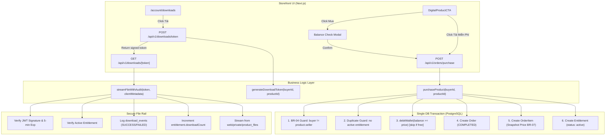

# Phase 5 Specification & Invariants Report: Purchase & Download

**Date**: 2026-09-15  
**Author**: `spec_miner_survey_1` (teamwork_preview_spec_miner)  
**Target Milestone**: Phase 5 (Purchase & Download)  
**Authoritative Sources**:
- `PLAN.md` (§8, §10, §11, §17, §18, §21, §22, §25, §26, §27, §29)
- `ORIGINAL_REQUEST.md` (R1 – R5, Acceptance Criteria)
- `docs/decisions/0002-money-write-layer.md`
- `docs/decisions/0003-p0-scope-lock.md`
- `docs/decisions/0005-financial-state-machine.md`
- `docs/decisions/0006-secure-download-path.md`
- `docs/decisions/0008-role-model.md`
- `docs/patterns/encoding-invariants.md`
- Existing codebase (`web/src/services/wallet.ts`, `web/src/collections/ProductFiles`, `web/src/collections/Products`, `web/src/collections/Wallets`, `web/src/migrations/`)

---

## 1. Observation

### 1.1 Authority Documents & Verbatim Requirements

1. **`PLAN.md` §27 (Phase 5 Roadmap & Exit Criteria)**:
   > "## Phase 5 — Purchase & Download  
   > Xây: Order, Purchase, Entitlement, Secure download, Purchase history, Free download.  
   > Exit criteria: `Top-up → Buy → Download` hoạt động end-to-end trên staging." (`PLAN.md:2835-2853`)

2. **`PLAN.md` §10 (Business Rules)**:
   - **BR-01** (No double-spend): "Wallet debit phải thực hiện trong DB transaction và lock thích hợp... UPDATE wallets SET balance = balance - :amount WHERE user_id = :user_id AND balance >= :amount; Chỉ tiếp tục nếu affected rows = 1." (`PLAN.md:1364-1378`)
   - **BR-04** (Anti-self-purchase): "Seller không tự mua sản phẩm của mình. Chặn self-purchase để hạn chế: Fake sales, Fake reviews, Rửa promotion/commission." (`PLAN.md:1405-1412`)
   - **BR-06** (Private original files): "Object storage bucket chứa file bán: PRIVATE. Không render public URL cố định." (`PLAN.md:1424-1433`)
   - **BR-07** (Snapshot pricing): "Giá tại order là snapshot. Nếu seller đổi giá sau đó, order cũ không đổi." (`PLAN.md:1436-1439`)

3. **`PLAN.md` §8 (Functional Requirements)**:
   - **FR-14** (Mua bằng ví): "Buyer click Mua → kiểm tra sản phẩm → kiểm tra seller/product status → kiểm tra số dư → transaction DB → trừ wallet → tạo order → tạo entitlement → ghi ledger → ghi seller earning → commit → trả quyền download... Nếu thiếu tiền: wallet < price → hiển thị số còn thiếu → CTA Nạp tiền." (`PLAN.md:606-636`)
   - **FR-15** (Đơn hàng): "Order lưu: order_code, buyer_id, items, subtotal, discount, total, payment_source, status, created_at, paid_at. Status: CREATED, PENDING_PAYMENT, PAID, COMPLETED, CANCELLED, REFUNDED, PARTIALLY_REFUNDED." (`PLAN.md:639-664`)
   - **FR-16** (Quyền tải file / Entitlement): "Đây là entity riêng, không suy luận chỉ từ order. entitlement: user_id, product_id, order_item_id, granted_at, expires_at nullable, max_downloads nullable, download_count, revoked_at nullable, reason. Buyer đã mua phải có thể tải lại theo policy." (`PLAN.md:668-686`)
   - **FR-17** (Secure Download): "Không trả URL storage vĩnh viễn. GET /downloads/{product} → auth → entitlement check → product/file status check → generate signed URL ngắn hạn → log download → redirect. Signed URL ví dụ: TTL 1–10 phút." (`PLAN.md:689-715`)
   - **FR-18** (Tải file miễn phí): "Free product -> yêu cầu login -> tạo FREE entitlement -> download." (`PLAN.md:718-738`)
   - **FR-19** (Lịch sử mua): "Buyer xem: Product, Order code, Giá đã mua, Ngày mua, Seller, Download, Download count, Review, Support." (`PLAN.md:740-754`)

4. **`PLAN.md` §11 (User Flows & Invariants)**:
   - **FLOW-U03**: "Click nhiều lần không được mua trùng ngoài ý muốn. Endpoint purchase phải idempotent. Giá được snapshot tại thời điểm mua. Product bị unpublish sau khi mua không tự động xóa entitlement, trừ trường hợp vi phạm/pháp lý." (`PLAN.md:1118-1124`)
   - **FLOW-U06**: "User click Download → Auth check → Entitlement check (nếu không có: 403 / CTA mua) → Kiểm tra file READY → Rate limit / abuse check → Tạo signed URL TTL ngắn → Ghi download event → Tải." (`PLAN.md:1179-1192`)
   - **FLOW-U07**: "Product FREE → User click Download → Đăng nhập? (Không: Login/Register; Có: Create/reuse FREE entitlement) → Generate signed URL → Download." (`PLAN.md:1195-1206`)

5. **`PLAN.md` §29 (Test Plan Bắt Buộc)**:
   - Order: "Purchase success. Double click. Product hidden between checkout. Price changed between page load/purchase. Seller self purchase." (`PLAN.md:2978-2984`)
   - Download: "No entitlement. Valid entitlement. Expired signed URL. Deleted/blocked file. Rate limit. Download logging." (`PLAN.md:2986-2993`)

6. **Architecture Decisions**:
   - **Decision 0002** (`docs/decisions/0002-money-write-layer.md`): "One write path... Every wallet balance change goes through a single server-side module using the Payload local API inside one database transaction, and is paired with a ledger row in the same transaction... Direct writes denied for every principal, including administrators... Refusal must be distinguishable from success: insufficient funds returns an explicit typed failure (`InsufficientFundsError`)."
   - **Decision 0006** (`docs/decisions/0006-secure-download-path.md`): "Download is entitlement-gated and served through an authenticated application route, not by a public URL... Access is granted by a short-lived one-time token with a lifetime between one and ten minutes per FR-17... storage bucket holding originals is private and no fixed public URL is rendered (BR-06)... Free downloads also create an entitlement (FR-18)... Download events are recorded per attempt."
   - **Decision 0003** (`docs/decisions/0003-p0-scope-lock.md:84-86`): "`order_items` carries the full snapshot column set (sale price, platform fee, seller amount, tax, applied policy version) from the first version so the commission rate lands later as configuration only."
   - **Decision 0005** (`docs/decisions/0005-financial-state-machine.md:65,107`): "Order statuses (`PLAN.md:654-664`) and withdrawal states (`PLAN.md:1041-1052`) are separate machines, each approved with its own slice... Phase 5: order machine plus purchase idempotency."

### 1.2 Observed Repository State

1. **Existing Database Schema & Migrations**:
   - PostgreSQL 16 on `127.0.0.1:5433` managed via Payload migrations (`push: false`).
   - 5 migrations executed (`20260915_020514_initial.ts`, `...023701_user_roles...`, `...033625_phase2...`, `...062953_phase3...`, `...064708_phase4_payment_wallet.ts`).
   - The template shipped an initial `orders` and `transactions` physical-goods table with shipping addresses and Stripe fields (`20260915_020514_initial.ts:874-930`), but per Decision 0002/0003, digital goods orders, `order_items`, `entitlements`, and `download_events` collections must be explicitly declared and migrated in Batch 6.
2. **Existing Money Write Layer** (`web/src/services/wallet.ts`):
   - `debitWallet(payload, params)`: Decrements balance conditionally with `WHERE "balance" >= ${amount}`, verifies affected rows, writes append-only `wallet_ledger` entry, throws `InsufficientFundsError`, `WalletFrozenError`, or `InvalidAmountError`.
   - `creditWallet(payload, params)`: Credits balance, writes ledger row.
   - `getOrCreateWallet(payload, { userId, req })`: Gets or initializes wallet with 0 VND balance.
   - Accepts `req` parameter allowing database transaction propagation (`req.transactionID`).
3. **Private Files Storage Boundary** (`web/src/collections/ProductFiles/index.ts`):
   - Storage directory: `web/private/product_files` (`path.resolve(dirname, '../../../private/product_files')`).
   - No `staticURL` property defined.
   - Access control (`web/src/access/productFileAccess.ts`): Admins/Moderators can read all; Sellers can read own; Buyers and public guests are strictly denied (`return false`).
4. **Digital Catalog State** (`web/src/collections/Products/index.ts`):
   - Fields: `title`, `price` (number, min 0, integer VND), `isFree` (checkbox), `seller` (relation to `users`), `originalFiles` (relation to `product_files`, `hasMany: true`), `moderationStatus` ('draft' | 'submitted' | 'in_review' | 'changes_requested' | 'approved' | 'rejected'), `_status` ('draft' | 'published').
5. **Existing Packages & Dependencies**:
   - `jsonwebtoken` (`9.0.1`) and `@types/jsonwebtoken` (`^9.0.7`) installed in `web/package.json:55,77`.
   - Environment secret `process.env.PAYLOAD_SECRET` is available.
6. **Existing Test Suite Baseline**:
   - 17 test suites (242 tests) in `web/tests/int` currently passing 100%.

---

## 2. Logic Chain

From the observed requirements and existing system architecture, we deduce the following technical design for Phase 5:



### 2.1 Schema Specifications (Payload Collections & PostgreSQL Batch 6 Migration)

#### A. Collection `orders`
- **Slug**: `orders`
- **Purpose**: Authoritative record of checkout transactions for digital goods.
- **Fields**:
  | Field Name | Type | Options / Constraints | Description |
  |---|---|---|---|
  | `code` | `text` | required, unique, indexed | Human-readable unique order code (e.g. `ORD-${Date.now()}-${random}`) |
  | `buyer` | `relationship` (`users`) | required, indexed | Authenticated purchaser |
  | `totalAmount` | `number` | required, min 0, integer VND | Total charged amount (0 for free products) |
  | `currency` | `select` | options: `['VND']`, default `'VND'` | Currency of record |
  | `status` | `select` | options: `['PENDING', 'COMPLETED', 'CANCELLED']`, default `'PENDING'` | Status of digital order (immediately `'COMPLETED'` on atomic wallet debit) |
  | `paymentSource` | `select` | options: `['wallet', 'free']`, default `'wallet'` | Payment mechanism used |
  | `paidAt` | `date` | nullable | Timestamp of successful payment |
  | `notes` | `textarea` | optional | Optional administrative or order notes |
- **Access Control**:
  - `read`: Admin & FinanceAdmin can read all; Buyers can only read orders where `buyer === user.id`. Public guests denied.
  - `create`, `update`, `delete`: Denied through collection REST/GraphQL for all principals (`canEditMoney` style or server-only). Order creation must go through the purchase service.
- **PostgreSQL Database Indices**:
  - `CREATE UNIQUE INDEX "orders_code_idx" ON "orders" ("code");`
  - `CREATE INDEX "orders_buyer_idx" ON "orders" ("buyer_id");`
  - `CREATE INDEX "orders_status_idx" ON "orders" ("status");`
  - `CREATE INDEX "orders_created_at_idx" ON "orders" ("created_at");`

#### B. Collection `order_items`
- **Slug**: `order_items`
- **Purpose**: Snapshot line-items carrying immutable sale price, fees, and seller attribution per BR-07 and Decision 0003.
- **Fields**:
  | Field Name | Type | Options / Constraints | Description |
  |---|---|---|---|
  | `order` | `relationship` (`orders`) | required, indexed | Parent order relation |
  | `product` | `relationship` (`products`) | required, indexed | Purchased product relation |
  | `seller` | `relationship` (`users`) | required, indexed | Seller attribution snapshot |
  | `salePrice` | `number` | required, min 0 | Snapshot unit price in VND at order creation (BR-07) |
  | `platformFee` | `number` | required, default 0 | Platform commission snapshot (Decision 0003:84-86) |
  | `sellerAmount` | `number` | required, default 0 | Net seller earning snapshot (`salePrice - platformFee`) |
  | `tax` | `number` | required, default 0 | Tax snapshot (default 0 for P0) |
  | `policyVersion` | `text` | required, default `'v1'` | Applied fee/commission policy version |
- **Access Control**:
  - `read`: Admin & FinanceAdmin; Buyer of order; Seller of product.
  - `create`, `update`, `delete`: Denied through collection REST/GraphQL. Immutable once created.
- **PostgreSQL Database Indices**:
  - `CREATE INDEX "order_items_order_idx" ON "order_items" ("order_id");`
  - `CREATE INDEX "order_items_product_idx" ON "order_items" ("product_id");`
  - `CREATE INDEX "order_items_seller_idx" ON "order_items" ("seller_id");`

#### C. Collection `entitlements`
- **Slug**: `entitlements`
- **Purpose**: Independent authority of asset ownership per PLAN.md FR-16, decoupling file access from the order lifecycle.
- **Fields**:
  | Field Name | Type | Options / Constraints | Description |
  |---|---|---|---|
  | `user` | `relationship` (`users`) | required, indexed | Entitled buyer/user |
  | `product` | `relationship` (`products`) | required, indexed | Owned product |
  | `order` | `relationship` (`orders`) | optional (nullable for free claims) | Originating order |
  | `orderItem` | `relationship` (`order_items`) | optional | Originating line item |
  | `status` | `select` | options: `['active', 'revoked', 'expired']`, default `'active'`, indexed | Lifecycle state |
  | `grantedAt` | `date` | required, default now | When access was established |
  | `expiresAt` | `date` | nullable | Optional expiration (null = perpetual access) |
  | `downloadCount` | `number` | required, default 0 | Cumulative successful download attempts |
  | `maxDownloads` | `number` | nullable | Optional limit on downloads (null = unlimited) |
  | `revokedAt` | `date` | nullable | Timestamp if revoked by admin/dispute |
  | `reason` | `text` | nullable | Reason for revocation or grant |
- **Access Control**:
  - `read`: Admin & FinanceAdmin; User can read own entitlements (`user === req.user.id`).
  - `create`, `delete`: Denied through collection REST/GraphQL.
  - `update`: Admin only (for revocation).
- **PostgreSQL Invariants & Indices**:
  - `CREATE INDEX "entitlements_user_idx" ON "entitlements" ("user_id");`
  - `CREATE INDEX "entitlements_product_idx" ON "entitlements" ("product_id");`
  - `CREATE INDEX "entitlements_status_idx" ON "entitlements" ("status");`
  - **Unique Active Constraint**: `CREATE UNIQUE INDEX "entitlements_user_product_active_idx" ON "entitlements" ("user_id", "product_id") WHERE ("status" = 'active');`  
    *(Guarantees a buyer can only hold exactly one active entitlement per product at the database level).*

#### D. Collection `download_events`
- **Slug**: `download_events`
- **Purpose**: Append-only security and abuse audit log for private file downloads per BR-06, FR-17, and Decision 0006.
- **Fields**:
  | Field Name | Type | Options / Constraints | Description |
  |---|---|---|---|
  | `user` | `relationship` (`users`) | optional, indexed | User initiating download (if authenticated) |
  | `product` | `relationship` (`products`) | required, indexed | Product targeted |
  | `entitlement` | `relationship` (`entitlements`) | optional, indexed | Entitlement verified |
  | `ipAddress` | `text` | optional | Client IP address for abuse heuristics |
  | `userAgent` | `text` | optional | Client User-Agent header |
  | `downloadedAt` | `date` | required, default now | Access attempt timestamp |
  | `status` | `select` | options: `['SUCCESS', 'DENIED', 'EXPIRED', 'FAILED']`, default `'SUCCESS'`, indexed | Outcome of stream attempt |
  | `downloadTokenHash` | `text` | optional | SHA-256 hash of token jti for replay tracking |
  | `errorReason` | `text` | optional | Reason for denial/failure |
- **Access Control**:
  - `read`: Admin & FinanceAdmin only.
  - `create`, `update`, `delete`: Denied for all principals via REST. Append-only.
- **PostgreSQL Database Indices**:
  - `CREATE INDEX "download_events_user_idx" ON "download_events" ("user_id");`
  - `CREATE INDEX "download_events_product_idx" ON "download_events" ("product_id");`
  - `CREATE INDEX "download_events_status_idx" ON "download_events" ("status");`
  - `CREATE INDEX "download_events_downloaded_at_idx" ON "download_events" ("downloaded_at");`

---

### 2.2 Business Rules & Invariants Enforcement Details

1. **BR-04 Anti-Self-Purchase Invariant**:
   - **Rule**: Sellers are strictly forbidden from buying their own products (`buyer.id !== product.seller.id`).
   - **Enforcement Layer 1 (Service)**: `purchaseProduct` compares `numericBuyerId` with `product.seller`. If identical, immediately throws typed `SelfPurchaseError`.
   - **Enforcement Layer 2 (Collection Hook)**: `beforeValidate` hook on `orders` and `order_items` queries the product seller and aborts if `buyer === seller`.
   - **Error**: HTTP 400 Bad Request `{ error: 'SELF_PURCHASE_FORBIDDEN', message: 'Người bán không thể tự mua sản phẩm của chính mình (BR-04)' }`.

2. **BR-06 Private Storage Boundary**:
   - **Rule**: Design files in `web/private/product_files` must NEVER be exposed publicly or accessed without entitlement verification.
   - **Enforcement**: Payload `ProductFiles` collection maintains `upload.staticDir` in `web/private/product_files` with NO `staticURL`. `productFileReadAccess` denies public and buyer access. File streaming happens exclusively through `GET /api/v1/downloads/[token]`.

3. **BR-07 Immutable Snapshot Pricing**:
   - **Rule**: The price recorded in `order_items.salePrice` is captured at the moment of checkout and is permanently immutable, even if the seller later modifies `products.price`.
   - **Enforcement**: `order_items` captures `salePrice = product.price` (or `0` if `product.isFree`). `order_items` denies update access for all roles.

4. **Atomic Wallet Debit Transaction (Decision 0002)**:
   - **Rule**: Money movement (`debitWallet`), order creation, and entitlement granting must be co-located in a single database transaction. If debit fails, no order is created. If entitlement creation fails, debit rolls back.
   - **Implementation**:
     ```ts
     const result = await payload.db.beginTransaction() // or local API transaction
     try {
       // 1. Validate product status & BR-04
       // 2. Validate entitlement uniqueness
       // 3. Debit wallet (skip if free)
       // 4. Create order (COMPLETED)
       // 5. Create order item
       // 6. Create entitlement (active)
       // commit
     } catch (err) {
       // rollback
       throw err
     }
     ```

5. **Single Active Entitlement Per Product (R2 & FR-16)**:
   - **Rule**: A buyer cannot hold more than one active entitlement for a given product.
   - **Enforcement**:
     - Database partial unique index: `(user_id, product_id) WHERE status = 'active'`.
     - Service layer pre-check: Query `entitlements` where `{ user: buyerId, product: productId, status: 'active' }`. If found, throw `AlreadyEntitledError` (HTTP 409) with `entitlementId` so the UI can offer a direct download button.

6. **Free Product Zero-Cost Checkout (FR-18 & R1)**:
   - **Rule**: When `product.isFree === true` or `product.price === 0`:
     - User MUST be authenticated.
     - Wallet balance is NOT checked or deducted (0 VND debit).
     - An order with `totalAmount: 0, paymentSource: 'free', status: 'COMPLETED'` is created.
     - An active entitlement is granted instantly.

---

### 2.3 Detailed API Specifications

#### Endpoint 1: `POST /api/v1/orders/purchase`
- **Description**: Atomically purchases a product from the buyer's internal wallet balance or claims a free product.
- **Authentication**: Required (`payload.auth({ headers })`).
- **Request Headers**: `Content-Type: application/json`
- **Request Body**:
  ```json
  {
    "productId": 42
  }
  ```
- **Responses**:
  - **`200 OK`**:
    ```json
    {
      "success": true,
      "order": {
        "id": 101,
        "code": "ORD-1726388400000-8F9A",
        "totalAmount": 150000,
        "status": "COMPLETED",
        "paymentSource": "wallet",
        "paidAt": "2026-09-15T07:15:00.000Z"
      },
      "entitlement": {
        "id": 202,
        "status": "active",
        "grantedAt": "2026-09-15T07:15:00.000Z"
      },
      "message": "Giao dịch mua tài nguyên số thành công."
    }
    ```
  - **`400 Bad Request` (Insufficient balance)**:
    ```json
    {
      "error": "INSUFFICIENT_FUNDS",
      "message": "Số dư ví không đủ để thực hiện giao dịch (Số dư: 50.000₫, Cần: 150.000₫)",
      "balance": 50000,
      "requiredAmount": 150000,
      "missingAmount": 100000
    }
    ```
  - **`400 Bad Request` (BR-04 Self purchase)**:
    ```json
    {
      "error": "SELF_PURCHASE_FORBIDDEN",
      "message": "Người bán không thể tự mua sản phẩm của chính mình (BR-04)"
    }
    ```
  - **`409 Conflict` (Already owned)**:
    ```json
    {
      "error": "ALREADY_ENTITLED",
      "message": "Bạn đã sở hữu tài nguyên số này.",
      "entitlementId": 202
    }
    ```
  - **`401 Unauthorized`**:
    ```json
    {
      "error": "UNAUTHORIZED",
      "message": "Vui lòng đăng nhập để mua tài nguyên số."
    }
    ```
  - **`404 Not Found`**:
    ```json
    {
      "error": "PRODUCT_NOT_FOUND",
      "message": "Sản phẩm không tồn tại hoặc chưa được xuất bản."
    }
    ```

#### Endpoint 2: `POST /api/v1/downloads/token`
- **Description**: Issues a short-lived, cryptographically signed token for an active entitlement holder.
- **Authentication**: Required.
- **Request Body**:
  ```json
  {
    "productId": 42
  }
  ```
- **Validation**:
  1. Authenticated user.
  2. Active entitlement exists for `(user.id, productId)`.
  3. Product has associated `product_files` with `status === 'READY'` and `virusScanStatus === 'clean'`.
- **Token Generation**:
  - JWT signed with `HS256` using `PAYLOAD_SECRET`.
  - Expiration: `Math.floor(Date.now() / 1000) + 300` (5-minute TTL).
  - Claims: `{ sub: user.id, productId, fileId, jti: uuid() }`.
- **Responses**:
  - **`200 OK`**:
    ```json
    {
      "success": true,
      "downloadToken": "eyJhbGciOiJIUzI1NiIsInR5cCI6...",
      "downloadUrl": "/api/v1/downloads/eyJhbGciOiJIUzI1NiIsInR5cCI6...",
      "expiresIn": 300,
      "filename": "ban-ve-biet-thu-hien-dai.dwg"
    }
    ```
  - **`403 Forbidden` (No active entitlement)**:
    ```json
    {
      "error": "ENTITLEMENT_REQUIRED",
      "message": "Bạn chưa sở hữu quyền tải tệp này. Vui lòng hoàn tất thanh toán trước khi tải."
    }
    ```
  - **`404 Not Found` (File not ready)**:
    ```json
    {
      "error": "FILE_NOT_READY",
      "message": "Tệp sản phẩm chưa sẵn sàng hoặc đang trong quá trình xử lý."
    }
    ```

#### Endpoint 3: `GET /api/v1/downloads/[token]`
- **Description**: Verifies the download token, audits the access event, and streams private file bytes.
- **Parameters**: `[token]` in dynamic route path.
- **Validation & Execution Flow**:
  1. Verify token signature and expiration via `jwt.verify(token, PAYLOAD_SECRET)`.
     - If expired or invalid signature: Log `download_events` with `status: 'EXPIRED'` or `'DENIED'`; return `401` / `403`.
  2. Re-verify that user still holds active entitlement.
  3. Locate physical file on disk: `web/private/product_files/<filename>`.
  4. Record `download_events` entry with `status: 'SUCCESS'`, `ipAddress`, `userAgent`, `timestamp`.
  5. Increment `entitlements.downloadCount` by 1.
  6. Stream file bytes as binary response.
- **Response Headers (Success 200)**:
  - `Content-Type`: MIME type from `product_files` or `application/octet-stream`
  - `Content-Disposition`: `attachment; filename="<originalFilename>"`
  - `Content-Length`: `<fileSize>`
  - `Cache-Control`: `private, no-cache, no-store, must-revalidate`

#### Endpoint 4: `GET /api/v1/me/orders`
- **Description**: Returns the authenticated buyer's order history.
- **Query Params**: `page=1&limit=10`
- **Response**: Paginated list of buyer's orders with item snapshots and total amounts.

#### Endpoint 5: `GET /api/v1/me/downloads` (or `/api/v1/me/entitlements`)
- **Description**: Returns the authenticated buyer's library of owned digital products.
- **Response**: List of active entitlements with product title, preview image, file specs, granted date, download count, and instant download trigger.

---

### 2.4 Storefront Purchase Flow & Buyer Library UI Integration

1. **Product Detail Page CTA Integration (`src/components/product/DigitalProductCTA.tsx`)**:
   - For Paid Products:
     - Button: **"Mua ngay bằng ví"** with price formatted in VND.
     - Modal: Shows buyer's current wallet balance (fetched live from `/api/v1/me/wallet`), product price, and remaining balance after purchase.
     - If balance is insufficient: Modal highlights the deficit amount and provides a direct CTA **"Nạp thêm tiền vào ví"** leading to `/wallet` with amount prefilled.
     - If balance is sufficient: Button **"Xác nhận mua ngay"** executes `POST /api/v1/orders/purchase`. Upon success, shows instant success confirmation and triggers `POST /api/v1/downloads/token` for direct file download.
   - For Free Products:
     - Button: **"Tải miễn phí ngay"** with download cloud icon.
     - If guest: Redirects to `/login?redirect=/products/[slug]`.
     - If logged in: Executes zero-cost purchase/claim, establishes entitlement, and initiates download.
   - For Already Owned Products:
     - If buyer already holds active entitlement: CTA transforms to **"Bạn đã sở hữu — Tải lại ngay"** linking directly to download without re-purchase.
2. **Buyer Library Page (`src/app/(app)/(account)/downloads/page.tsx` & updated `/orders/page.tsx`)**:
   - Navigation item added under Buyer Account: **"Tệp đã mua / Tải xuống"** (`/account/downloads`).
   - Displays all assets with active entitlements: Thumbnail, Title, Seller name, Granted Date, Format (`.dwg`, `.rvt`), Download Count, and **"Tải xuống"** button that requests a fresh 5-minute token and downloads the file.
   - Order history page (`/account/orders`) displays snapshot receipts, order codes, payment source, and status.

---

### 2.5 Error Taxonomy & HTTP Status Mapping

| Error Class | HTTP Code | Error Code | Trigger Condition | Observable Response |
|---|---|---|---|---|
| `UnauthorizedError` | `401` | `UNAUTHORIZED` | Unauthenticated guest attempts to buy or generate download token | `{ error: 'UNAUTHORIZED', message: '...' }` |
| `InsufficientFundsError` | `400` | `INSUFFICIENT_FUNDS` | Buyer's wallet balance < product price | `{ error: 'INSUFFICIENT_FUNDS', balance, requiredAmount, missingAmount }` |
| `SelfPurchaseError` | `400` | `SELF_PURCHASE_FORBIDDEN` | Seller attempts to buy their own product (BR-04) | `{ error: 'SELF_PURCHASE_FORBIDDEN', message: '...' }` |
| `AlreadyEntitledError` | `409` | `ALREADY_ENTITLED` | Buyer already holds active entitlement for product | `{ error: 'ALREADY_ENTITLED', entitlementId: ... }` |
| `ProductNotAvailableError` | `400` | `PRODUCT_NOT_AVAILABLE` | Product is not published or moderationStatus != approved | `{ error: 'PRODUCT_NOT_AVAILABLE', message: '...' }` |
| `EntitlementRequiredError` | `403` | `ENTITLEMENT_REQUIRED` | User requests token without holding active entitlement | `{ error: 'ENTITLEMENT_REQUIRED', message: '...' }` |
| `TokenExpiredError` | `401` | `TOKEN_EXPIRED` | Download token has passed 5-minute TTL | `{ error: 'TOKEN_EXPIRED', message: '...' }` |
| `InvalidTokenError` | `403` | `INVALID_TOKEN` | Token signature mismatch, tampered payload, or malformed | `{ error: 'INVALID_TOKEN', message: '...' }` |
| `FileNotFoundError` | `404` | `FILE_NOT_FOUND` | Physical file missing from `web/private/product_files` | `{ error: 'FILE_NOT_FOUND', message: '...' }` |

---

## 3. Caveats

1. **Payload Plugin Ecommerce Pre-existing Collections**:
   - The initial template shipped `@payloadcms/plugin-ecommerce` which created an initial `orders` and `transactions` table designed for Stripe physical goods.
   - For Phase 5, `orders` must be reconciled or digital `orders`, `order_items`, `entitlements`, and `download_events` explicitly registered as proper Payload collections with migration Batch 6. The existing `ecommercePlugin` in `web/src/plugins/index.ts` should set `orders: false` if separate custom `Orders` collection is registered, or properly configure `ordersCollectionOverride` to avoid collision.
2. **Transaction Isolation in PostgreSQL**:
   - `payload.db.beginTransaction()` and `req.transactionID` must be passed consistently through `debitWallet`, `orders.create`, `order_items.create`, and `entitlements.create` to ensure genuine atomicity.
3. **Download Stream Memory Usage**:
   - For large CAD/BIM files (e.g. 50MB - 500MB), `GET /api/v1/downloads/[token]` should use Node.js `fs.createReadStream` piped into the `NextResponse` Web `ReadableStream` rather than reading the entire file into a RAM buffer (`fs.readFileSync`), preventing memory leaks and high LCP/server stalls.
4. **Token Replay Window (5 minutes)**:
   - Within the 5-minute TTL, a buyer can initiate a browser download or resume an interrupted download. Recording `download_events` per attempt satisfies the P0 abuse detection requirement (FR-17 & Decision 0006).

---

## 4. Conclusion

Phase 5 delivers the core value proposition of KienTaoHub: converting internal wallet funds into verified digital asset ownership and authenticated file downloads. The authoritative specifications and invariants mined from the repository provide complete clarity for schema design, service implementation, API contracts, and verification.

### Features Discovered

| # | Category | Feature | Description | Inputs | Outputs | Error Behavior | Discovered Via |
|---|---|---|---|---|---|---|---|
| 1 | Checkout | Wallet Purchase (`FR-14`, `R1`) | Purchases digital product from internal wallet balance atomically | `productId` (auth user) | `order`, `entitlement` | `400` if insufficient balance, `409` if owned | `PLAN.md:606`, `ORIGINAL_REQUEST.md:16` |
| 2 | Checkout | Anti-Self-Purchase (`BR-04`) | Prevents seller from purchasing their own digital products | `productId`, `buyerId` | Blocked execution | `400 SELF_PURCHASE_FORBIDDEN` | `PLAN.md:1405`, `ORIGINAL_REQUEST.md:19` |
| 3 | Checkout | Free Product Claim (`FR-18`) | Zero-cost checkout granting instant entitlement for free products | `productId` (auth user) | `order` (0 VND), `entitlement` | `401` if unauthenticated | `PLAN.md:718`, `ORIGINAL_REQUEST.md:21` |
| 4 | Order | Snapshot Pricing (`BR-07`, `R1`) | Captures immutable price & commission fees in `order_items` at purchase time | `product.price` | `order_items.salePrice` | Immutable; updates to product price ignored | `PLAN.md:1436`, Decision 0003:84 |
| 5 | Entitlement | Ownership Ledger (`FR-16`, `R2`) | Independent authority entity tracking user asset ownership | `user`, `product`, `order` | Entitlement row (`status: active`) | Denied direct CRUD from REST | `PLAN.md:668`, Decision 0006:18 |
| 6 | Entitlement | Single Active Entitlement (`R2`) | Restricts buyer to holding only one active entitlement per product | `userId`, `productId` | Unique constraint enforced | `409 ALREADY_ENTITLED` | `ORIGINAL_REQUEST.md:26` |
| 7 | Download | Private Storage Rail (`BR-06`) | Private files stored in `web/private/` with no static public URL | File upload/read | Protected path | `403` direct access denied | `PLAN.md:1424`, `ProductFiles:102` |
| 8 | Download | Signed Token Generation (`FR-17`, `R3`) | Issues cryptographically signed 5-minute token for entitled buyers | `productId` (auth user) | JWT token, download URL | `403` if no active entitlement | Decision 0006:39, `ORIGINAL_REQUEST.md:32` |
| 9 | Download | Stream & Audit Handler (`FR-17`, `R3`) | Verifies token, logs `download_events`, and streams file bytes | `[token]` | Binary file stream | `401` if expired, `403` if invalid | Decision 0006:35, `ORIGINAL_REQUEST.md:33` |
| 10 | Library | Buyer Library UI (`FR-19`, `R4`) | Interface showing purchased files, specs, and direct download buttons | Authenticated session | UI render (`/account/downloads`) | Redirect to login if guest | `PLAN.md:740`, `ORIGINAL_REQUEST.md:40` |
| 11 | Storefront | Purchase CTA Modal (`R4`) | Balance check modal with insufficient funds prompt and top-up link | Click "Mua ngay bằng ví" | Modal UI | Prompts top-up if wallet < price | `PLAN.md:628`, `ORIGINAL_REQUEST.md:38` |

### Edge Cases

| # | Feature | Input | Observed / Expected Behavior |
|---|---|---|---|
| 1 | Wallet Purchase | Concurrent double-click purchase requests from buyer | PostgreSQL conditional update on wallet + unique constraint on active entitlement ensures only one request succeeds; second request returns `409 ALREADY_ENTITLED`. No double debit. |
| 2 | Wallet Purchase | Buyer wallet balance exactly equal to product price | Wallet balance transitions cleanly to `0` VND; order and entitlement succeed. |
| 3 | Wallet Purchase | Product price altered by seller between page view and checkout | Checkout uses the current database price at transaction time; if buyer balance is less than new price, transaction fails with `INSUFFICIENT_FUNDS`. If succeeded, snapshot stores new price. |
| 4 | Wallet Purchase | Product unpublished/hidden immediately before purchase | Purchase is rejected because `_status !== 'published'` or `moderationStatus !== 'approved'`. |
| 5 | Free Download | Guest user clicks "Tải miễn phí ngay" | Redirects to `/login?redirect=/products/[slug]`. No anonymous entitlement granted (FR-18). |
| 6 | Download Rail | Download token requested at `t=0`, redeemed at `t=301s` (5m 1s) | Token verification rejects with `401 TOKEN_EXPIRED`. An audit row is logged in `download_events` with `status: 'EXPIRED'`. |
| 7 | Download Rail | Tampered JWT token (modified `productId` or `userId`) | Cryptographic signature validation fails; rejected with `403 INVALID_TOKEN`. Audit row logged with `status: 'DENIED'`. |
| 8 | Download Rail | Entitlement revoked by administrator after token generated | Download endpoint re-verifies entitlement status; returns `403 ENTITLEMENT_REQUIRED`. |
| 9 | Download Rail | Multiple downloads using the same token within 5-minute window | Permitted to allow download resumption. Each completed stream logs an audit event and increments `downloadCount`. |
| 10 | Storefront UI | Seller visits their own product page | CTA button disables "Mua ngay bằng ví" or shows "Bạn là người bán của sản phẩm này (BR-04)", preventing self-purchase attempt. |

---

## 5. Verification Method

### 5.1 Independent Test Suite Specifications

Three dedicated integration test suites must be created in `web/tests/int`:

1. **`tests/int/purchase-workflow.int.spec.ts`**:
   - Test 1: Full `Top-up → Buy → Download` end-to-end atomic workflow.
     - Credit buyer wallet with 200,000 VND.
     - Execute purchase of 150,000 VND product.
     - Verify wallet balance debited to 50,000 VND and ledger entry created.
     - Verify order created with status `COMPLETED` and totalAmount 150,000 VND.
     - Verify active entitlement created.
     - Generate download token and verify successful 200 stream.
   - Test 2: Free product purchase flow.
     - Free product (`isFree: true`, price 0).
     - Buy with 0 VND balance.
     - Verify wallet balance remains 0 VND.
     - Verify active entitlement created and download succeeds.
   - Test 3: Transaction atomicity rollback test.
     - Inject failure during entitlement creation (or force DB rollback).
     - Verify wallet balance was NOT decremented and ledger entry was NOT persisted.

2. **`tests/int/secure-download.int.spec.ts`**:
   - Test 1: Token generation requires authenticated user with active entitlement.
   - Test 2: User without entitlement is rejected with 403.
   - Test 3: Token expires after 5 minutes (test with expired JWT timestamp) and returns 401.
   - Test 4: Tampered token signature is rejected with 403.
   - Test 5: Successful download streams correct MIME type, content disposition, and logs `download_events` row with status `SUCCESS`.

3. **`tests/int/purchase-invariants.int.spec.ts`**:
   - Test 1: BR-04 Anti-Self-Purchase: Seller attempting to purchase own product is rejected with `SelfPurchaseError` (HTTP 400).
   - Test 2: BR-07 Snapshot Pricing: Altering product price after order creation does not alter `order_items.salePrice`.
   - Test 3: Insufficient balance rejects with `InsufficientFundsError` and creates 0 orders/entitlements.
   - Test 4: Duplicate purchase of already owned product rejects with `AlreadyEntitledError` (HTTP 409).

### 5.2 Command Line Verification Sequence

```bash
# 1. Run new Phase 5 integration test suites
pnpm --prefix web test:int tests/int/purchase-workflow.int.spec.ts
pnpm --prefix web test:int tests/int/secure-download.int.spec.ts
pnpm --prefix web test:int tests/int/purchase-invariants.int.spec.ts

# 2. Run full regression across all integration test suites (242 existing + new)
pnpm --prefix web test:int

# 3. Run challenger and stress test suites
pnpm --prefix web test:challenger
pnpm --prefix web test:stress

# 4. Code quality & build verification
pnpm --prefix web lint
pnpm --prefix web build
```

**Invalidation Conditions**:
- Any regression in the existing 17 test suites (242 tests).
- Any leakage of private original files without active entitlement.
- Any discrepancy in wallet balance vs ledger sum.
- Any ability for sellers to buy their own products.
