# PLAN.md — KienTaoHub

> **Tên dự án làm việc:** **KienTaoHub**  
> **Loại sản phẩm:** Marketplace mua bán / chia sẻ bản vẽ, hồ sơ thiết kế và tài nguyên kỹ thuật số  
> **Thị trường chính:** Việt Nam  
> **Định hướng:** Nhanh, SEO tốt, giao dịch tự động 24/7, dễ mở rộng, ưu tiên trải nghiệm tải file và quản lý người bán  
> **Phiên bản tài liệu:** 1.0  
> **Ngày lập:** 2026-09-14

---

## 1. Tóm tắt sản phẩm

KienTaoHub là web app marketplace cho phép người dùng:

- Tìm kiếm và xem trước bản vẽ / tài liệu kỹ thuật.
- Tải tài liệu miễn phí hoặc mua tài liệu có phí.
- Nạp tiền vào ví để mua file.
- Thanh toán trực tiếp cho một đơn hàng nếu không muốn nạp ví.
- Quản lý lịch sử mua và tải lại các file đã mua.
- Đánh giá, bình luận, báo lỗi file và gửi khiếu nại.
- Trở thành người bán, đăng file và nhận doanh thu.
- Rút doanh thu về tài khoản ngân hàng sau khi đủ điều kiện.
- Admin duyệt tài liệu, quản lý giao dịch, khiếu nại, người dùng, người bán, SEO, nội dung và báo cáo.

Sản phẩm tham khảo mô hình nghiệp vụ của các marketplace bản vẽ tại Việt Nam, nhưng giao diện, thương hiệu, kiến trúc hệ thống và trải nghiệm người dùng phải được xây dựng mới.

---

## 2. Tên thương hiệu

### 2.1 Tên chính dùng trong dự án

**KienTaoHub**

Ý nghĩa:

- "Kiến Tạo": liên quan kiến trúc, xây dựng, thiết kế và sáng tạo.
- "Hub": trung tâm tập hợp tài nguyên.
- Không khóa sản phẩm vào riêng AutoCAD.
- Có thể mở rộng sang Revit, SketchUp, 3ds Max, BIM, PDF, Excel dự toán, tài liệu kỹ thuật và asset thiết kế.

> Tên miền chưa phải phạm vi quyết định của tài liệu này. Cần kiểm tra pháp lý, nhãn hiệu và domain trước khi phát hành chính thức.

### 2.2 Tên dự phòng

- KienTrucHub
- FileKienTao
- DesignKho
- BuildFiles
- CADNest

---

## 3. Mục tiêu sản phẩm

### 3.1 Mục tiêu kinh doanh

1. Xây dựng marketplace tài nguyên kỹ thuật số có thể hoạt động tự động 24/7.
2. Thu hút traffic từ Google thông qua hàng chục nghìn landing page sản phẩm, danh mục và từ khóa.
3. Tạo nguồn cung file từ cộng đồng seller.
4. Tạo doanh thu từ commission trên từng giao dịch.
5. Tăng tỷ lệ quay lại bằng ví điện tử nội bộ, lịch sử mua, yêu thích và gợi ý nội dung.
6. Giảm tối đa thao tác thủ công trong nạp tiền, giao file và tính doanh thu seller.

### 3.2 Mục tiêu kỹ thuật

1. Phản hồi nhanh kể cả khi catalog lớn.
2. Trang sản phẩm SEO index tốt.
3. Không để giao dịch tiền bị ghi nhận trùng do webhook gửi lại.
4. File gốc không được public trực tiếp.
5. Có thể scale riêng API, search, worker và storage.
6. Có audit log cho các thao tác ảnh hưởng tiền, quyền tải và nội dung.
7. Có cơ chế backup và khôi phục rõ ràng.

---

## 4. Phạm vi sản phẩm

### 4.1 Trong phạm vi

- Marketplace file số.
- Catalog nhiều danh mục.
- Search và filter.
- Trang chi tiết sản phẩm.
- File miễn phí và file có phí.
- Tài khoản người dùng.
- Ví nội bộ.
- Thanh toán.
- Download có kiểm soát.
- Seller.
- Revenue share.
- Rút tiền.
- Review / comment.
- Favorite.
- Support / dispute.
- Admin CMS.
- SEO.
- Dashboard.
- Notifications.
- Analytics.
- Anti-abuse cơ bản.

### 4.2 Ngoài phạm vi MVP

- Dịch vụ thuê kiến trúc sư / freelancer.
- Chat realtime buyer-seller.
- Đấu giá.
- Subscription tải không giới hạn.
- App iOS / Android native.
- Blockchain / NFT.
- DRM chuyên dụng phía client.
- Marketplace vật lý.
- Hệ thống CAD editor trực tiếp trên web.

---

# 5. Các vai trò trong hệ thống

## 5.1 Guest

Chưa đăng nhập.

Quyền:

- Xem homepage.
- Duyệt category.
- Search.
- Xem trang sản phẩm.
- Xem preview.
- Xem seller profile.
- Xem review.
- Đăng ký / đăng nhập.

Không được:

- Mua.
- Tải file có kiểm soát.
- Đánh giá.
- Bình luận.
- Yêu thích.
- Đăng bán.

---

## 5.2 Buyer

Người dùng đã đăng nhập.

Có thể:

- Nạp tiền.
- Mua file.
- Thanh toán trực tiếp.
- Tải file miễn phí.
- Tải lại file đã mua.
- Xem lịch sử giao dịch.
- Yêu thích.
- Review.
- Comment.
- Tạo ticket.
- Báo lỗi / khiếu nại.

---

## 5.3 Seller

Buyer đã được kích hoạt quyền bán.

Có thể:

- Tạo sản phẩm.
- Upload file.
- Upload preview.
- Đặt giá.
- Gửi duyệt.
- Chỉnh sửa sản phẩm theo trạng thái cho phép.
- Xem lượt xem / lượt tải / doanh thu.
- Xem giao dịch bán.
- Xem số dư pending / available.
- Yêu cầu rút tiền.
- Quản lý hồ sơ người bán.

---

## 5.4 Moderator

Có thể:

- Duyệt / từ chối sản phẩm.
- Kiểm tra preview.
- Xử lý report.
- Ẩn sản phẩm.
- Xử lý comment / review vi phạm.
- Yêu cầu seller sửa nội dung.

Không mặc định được:

- Chỉnh số dư.
- Duyệt rút tiền.
- Sửa giao dịch tài chính.

---

## 5.5 Finance Admin

Có thể:

- Xem payment.
- Đối soát.
- Duyệt withdrawal.
- Refund theo policy.
- Xử lý giao dịch lỗi.
- Xem ledger.
- Export báo cáo tài chính.

---

## 5.6 Super Admin

Toàn quyền:

- Users.
- Roles.
- Permissions.
- Catalog.
- Transactions.
- Seller.
- Withdrawals.
- CMS.
- SEO.
- System config.
- Audit logs.

---

# 6. Mô hình kinh doanh

## 6.1 Loại sản phẩm

Mỗi listing là một **Digital Product**.

Ví dụ:

- File CAD.
- Revit.
- SketchUp.
- 3ds Max.
- Lumion.
- BIM.
- PDF thuyết minh.
- Excel dự toán.
- Word.
- File CNC.
- Bộ thư viện.
- Source code / tài liệu kỹ thuật nếu hệ thống cho phép.

---

## 6.2 Giá sản phẩm

Hỗ trợ:

- Miễn phí.
- Có phí.
- Giá khuyến mại.
- Giá gốc + giá sale.
- Thời gian sale.
- Coupon ở giai đoạn sau.

Tiền tệ MVP:

- VND.

Lưu tiền dưới dạng integer, ví dụ:

```text
199000 = 199.000 VND
```

Không dùng floating point cho tiền.

---

## 6.3 Commission

Ví dụ cấu hình:

```text
Giá bán:             100.000
Phí nền tảng:         30.000
Doanh thu seller:     70.000
```

Không hard-code tỷ lệ.

Hệ thống cần hỗ trợ:

- Commission mặc định toàn site.
- Commission riêng theo seller.
- Commission riêng theo campaign.
- Thay đổi commission không ảnh hưởng giao dịch cũ.

Mỗi order item phải lưu snapshot:

- sale_price
- platform_fee
- seller_amount
- tax nếu có
- applied_policy_version

---

# 7. Chức năng chính — Functional Requirements

## FR-01 — Homepage

Homepage gồm:

- Header.
- Search lớn.
- Mega menu danh mục.
- Bản vẽ mới.
- Bản vẽ nổi bật.
- Bản vẽ bán chạy.
- File miễn phí.
- Collection.
- Danh mục nổi bật.
- Seller nổi bật.
- Nội dung hướng dẫn / blog.
- CTA đăng bán.
- Footer.

Có thể cấu hình section từ Admin.

---

## FR-02 — Danh mục

Category tree nhiều cấp.

Ví dụ:

```text
Kiến trúc
├── Nhà phố
├── Biệt thự
├── Chung cư
├── Khách sạn
└── Trường học

Kết cấu
MEP
Điện
Cấp thoát nước
Quy hoạch
Nội thất
Cơ khí
CNC
Đồ án
Thư viện
```

Mỗi category có:

- name
- slug
- parent
- icon
- thumbnail
- description
- SEO title
- SEO description
- canonical
- trạng thái
- sort order

---

## FR-03 — Loại file / phần mềm

Taxonomy riêng:

- AutoCAD
- Revit
- SketchUp
- 3ds Max
- Lumion
- PDF
- Excel
- Word
- SolidWorks
- ArchiCAD
- Blender
- CNC/JDP
- Khác

Có thể filter theo software.

---

## FR-04 — Search

Search theo:

- Tên.
- Mã sản phẩm.
- Mô tả.
- Tag.
- Category.
- Software.
- Seller.

Filter:

- Miễn phí / có phí.
- Khoảng giá.
- Category.
- Software.
- Rating.
- Mới nhất.
- Bán chạy.
- Xem nhiều.
- Giá tăng / giảm.

Yêu cầu:

- Không phân biệt hoa thường.
- Hỗ trợ tiếng Việt.
- Xử lý từ khóa không dấu.
- Typo tolerance ở mức hợp lý.
- Suggest/autocomplete.
- Search analytics.

---

## FR-05 — Trang chi tiết sản phẩm

Bắt buộc hiển thị:

- Mã sản phẩm.
- Title.
- Category.
- Seller.
- Giá.
- Sale price.
- Software.
- Version nếu có.
- Loại file.
- File size.
- Ngày cập nhật.
- Nội dung mô tả.
- Danh sách file / nội dung bộ file.
- Preview image.
- Gallery.
- Preview PDF nếu cho phép.
- Rating.
- Download count.
- View count.
- Tag.
- Sản phẩm liên quan.
- Sản phẩm cùng seller.
- CTA Mua / Tải miễn phí.
- Favorite.
- Share.
- Report.

Phải phân biệt rõ:

```text
Ảnh preview != file gốc.
```

---

## FR-06 — Preview

Seller upload:

- Cover image.
- N preview images.
- Optional preview PDF.

Hệ thống xử lý:

- Resize.
- Thumbnail.
- WebP/AVIF nếu phù hợp.
- Watermark preview tùy cấu hình.
- Không expose file gốc.

---

## FR-07 — Đăng ký

Các phương án:

- Email + password.
- Google OAuth.
- Facebook OAuth có thể P1.

Yêu cầu:

- Verify email.
- Rate limit.
- CAPTCHA nếu rủi ro.
- Terms acceptance.

---

## FR-08 — Đăng nhập

- Email/password.
- OAuth.
- Remember session.
- Forgot password.
- Reset password.
- Logout all devices.
- Session management.

---

## FR-09 — Hồ sơ người dùng

- Avatar.
- Display name.
- Email.
- Phone.
- Password.
- Notification settings.
- Billing details.
- Bank account nếu là seller.
- Security activity.

---

## FR-10 — Favorite

Buyer có thể:

- Save product.
- Remove.
- Xem danh sách favorite.
- Sort favorite.

---

## FR-11 — Ví người dùng

Wallet dùng cho tiền đã nạp.

Hiển thị:

- Current available balance.
- Tổng đã nạp.
- Tổng đã chi.
- Transaction history.

Không sửa trực tiếp `balance` mà không tạo ledger entry.

---

## FR-12 — Nạp tiền

Flow:

1. Buyer chọn nạp tiền.
2. Chọn số tiền hoặc nhập số tiền.
3. System tạo payment intent.
4. Hiển thị QR / thông tin thanh toán.
5. Provider xác nhận qua webhook.
6. System verify chữ ký.
7. Kiểm tra idempotency.
8. Payment chuyển sang PAID.
9. Ledger ghi CREDIT.
10. Wallet được cập nhật.
11. Gửi notification.

Hỗ trợ provider theo adapter.

Ví dụ:

- SePay / bank transfer QR.
- VNPay.
- MoMo.
- ZaloPay.
- Provider khác về sau.

---

## FR-13 — Thanh toán trực tiếp

Ngoài wallet, buyer có thể chọn:

```text
Mua ngay -> Thanh toán -> Payment provider -> Thành công -> Nhận quyền tải
```

MVP có thể triển khai:

- Wallet purchase là P0.
- Direct payment là P1.

---

## FR-14 — Mua bằng ví

### Điều kiện đủ tiền

```text
Buyer click Mua
→ kiểm tra sản phẩm
→ kiểm tra seller/product status
→ kiểm tra số dư
→ transaction DB
→ trừ wallet
→ tạo order
→ tạo entitlement
→ ghi ledger
→ ghi seller earning
→ commit
→ trả quyền download
```

### Điều kiện thiếu tiền

```text
Buyer click Mua
→ wallet < price
→ hiển thị số còn thiếu
→ CTA Nạp tiền
→ payment
→ quay lại product/order
→ tiếp tục mua
```

---

## FR-15 — Đơn hàng

Order lưu:

- order_code
- buyer_id
- items
- subtotal
- discount
- total
- payment_source
- status
- created_at
- paid_at

Status:

```text
CREATED
PENDING_PAYMENT
PAID
COMPLETED
CANCELLED
REFUNDED
PARTIALLY_REFUNDED
```

---

## FR-16 — Quyền tải file / Entitlement

Đây là entity riêng, không suy luận chỉ từ order.

```text
entitlement:
- user_id
- product_id
- order_item_id
- granted_at
- expires_at nullable
- max_downloads nullable
- download_count
- revoked_at nullable
- reason
```

Buyer đã mua phải có thể tải lại theo policy.

---

## FR-17 — Secure Download

Không trả URL storage vĩnh viễn.

Flow:

```text
GET /downloads/{product}
→ auth
→ entitlement check
→ product/file status check
→ generate signed URL ngắn hạn
→ log download
→ redirect
```

Signed URL ví dụ:

- TTL 1–10 phút.

Có thể thêm:

- Rate limit.
- Download limit.
- Device/IP heuristic.
- Abuse detection.

---

## FR-18 — Tải file miễn phí

Có thể cấu hình:

- Guest được tải.
- Hoặc bắt buộc login.

Khuyến nghị MVP:

```text
Free product -> yêu cầu login -> tạo FREE entitlement -> download
```

Lợi ích:

- Có lịch sử.
- Analytics.
- Chống scraping.
- Có thể review.

---

## FR-19 — Lịch sử mua

Buyer xem:

- Product.
- Order code.
- Giá đã mua.
- Ngày mua.
- Seller.
- Download.
- Download count.
- Review.
- Support.

---

## FR-20 — Review

Chỉ tài khoản có entitlement hợp lệ mới được review.

Fields:

- star 1–5.
- title optional.
- content.
- created_at.
- updated_at.

Chống:

- Review giả.
- Review trùng.
- Spam.

Có trạng thái moderation.

---

## FR-21 — Comment / Q&A

Có thể comment tại product.

P0:

- User comment.
- Seller/Admin reply.
- Report.
- Hide.

P1:

- Thread.
- Mention.
- Notification.

---

## FR-22 — Report sản phẩm

Reason:

- File lỗi.
- Nội dung không đúng.
- Vi phạm bản quyền.
- Spam.
- Nội dung cấm.
- Preview gây hiểu nhầm.
- Khác.

Tạo moderation case.

---

## FR-23 — Support Ticket

Buyer tạo ticket liên quan:

- Order.
- Product.
- Payment.
- Download.
- Refund.

Status:

```text
OPEN
IN_PROGRESS
WAITING_USER
RESOLVED
CLOSED
```

---

# 8. Seller Module

## FR-24 — Đăng ký seller

Flow:

```text
Buyer
→ Đăng ký bán
→ đọc/đồng ý Seller Terms
→ nhập profile
→ thông tin nhận tiền
→ xác thực cần thiết
→ Admin approve / auto approve theo policy
→ Seller active
```

MVP có thể không yêu cầu KYC tự động, nhưng phải có khả năng bổ sung sau.

---

## FR-25 — Seller Dashboard

KPI:

- Revenue today.
- Revenue month.
- Pending balance.
- Available balance.
- Withdrawn total.
- Orders.
- Downloads.
- Product views.
- Conversion rate.
- Top products.

---

## FR-26 — Tạo sản phẩm

Fields:

- Title.
- Slug auto.
- Category.
- Subcategory.
- Software.
- Software version.
- Description.
- Short description.
- Tags.
- Original price.
- Sale price.
- Free/paid.
- Cover.
- Preview gallery.
- Download files.
- File list.
- File size.
- Notes.
- Copyright declaration.

---

## FR-27 — Upload file

Yêu cầu:

- Multipart/resumable nếu file lớn.
- Upload trực tiếp object storage bằng signed upload URL.
- Validate extension.
- Validate MIME.
- Maximum size theo plan/config.
- Virus/malware scan.
- Calculate checksum.
- Không public.

Status:

```text
UPLOADING
PROCESSING
READY
FAILED
QUARANTINED
```

---

## FR-28 — Quy trình duyệt sản phẩm

State machine:

```text
DRAFT
↓
SUBMITTED
↓
IN_REVIEW
├── CHANGES_REQUESTED → DRAFT
├── REJECTED
└── APPROVED → PUBLISHED
                    ↓
                  HIDDEN
                    ↓
                 ARCHIVED
```

Moderator phải lưu:

- reviewer.
- reason.
- note.
- timestamp.

---

## FR-29 — Chỉnh sửa sản phẩm đã bán

Những thay đổi nhạy cảm cần policy:

- Thay file gốc.
- Thay description lớn.
- Thay category.
- Thay price.

Nếu seller thay file gốc:

```text
new file version
→ scan
→ moderation nếu cần
→ publish version
```

Không overwrite mất lịch sử file cũ mà không có version.

---

## FR-30 — Product Versioning

Lưu:

- product version.
- file version.
- checksum.
- upload timestamp.
- changelog.

Buyer mua trước đó có được file mới hay không tùy policy.

Khuyến nghị:

- Cho phép tải version mới miễn phí cho cùng product.
- Admin có thể khóa quyền này với loại sản phẩm đặc biệt.

---

## FR-31 — Seller Earnings

Khi order hoàn tất:

```text
seller earning = PENDING
```

Sau hold period:

```text
PENDING → AVAILABLE
```

Ví dụ hold:

- 3 ngày.
- 7 ngày.
- cấu hình được.

Mục đích:

- Có thời gian xử lý refund / fraud.

---

## FR-32 — Rút tiền

Seller nhập:

- Amount.
- Bank.
- Account number.
- Account holder.

Flow:

```text
Seller request withdrawal
→ validate available balance
→ reserve balance
→ status REQUESTED
→ Finance review
→ APPROVED
→ payout
→ PAID
```

State:

```text
REQUESTED
UNDER_REVIEW
APPROVED
PROCESSING
PAID
REJECTED
CANCELLED
FAILED
```

Tất cả thay đổi phải có audit log.

---

# 9. Luồng nghiệp vụ người dùng

# FLOW-U01 — Khách tìm và xem bản vẽ

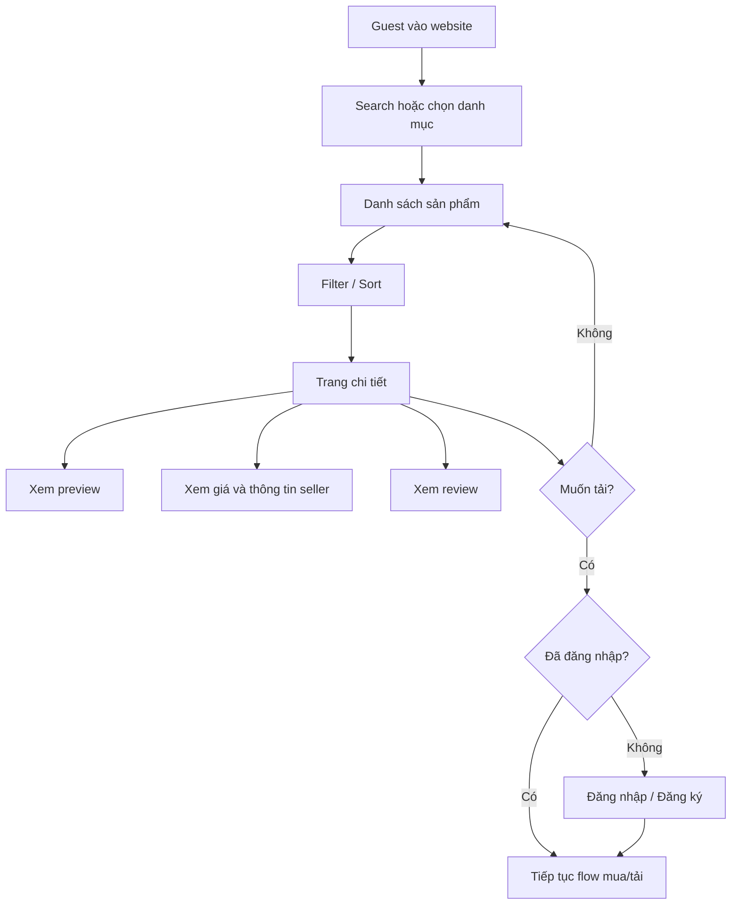

---

# FLOW-U02 — Đăng ký tài khoản

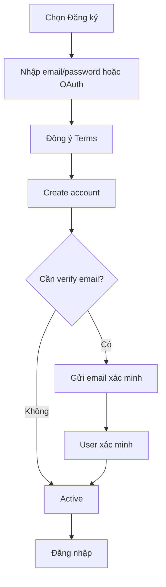

---

# FLOW-U03 — Mua file khi ví đủ tiền

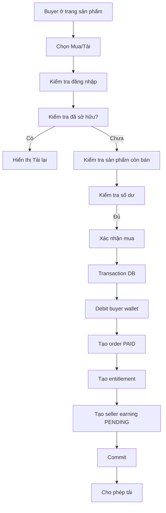

Quy tắc:

- Click nhiều lần không được mua trùng ngoài ý muốn.
- Endpoint purchase phải idempotent.
- Giá được snapshot tại thời điểm mua.
- Product bị unpublish sau khi mua không tự động xóa entitlement, trừ trường hợp vi phạm/pháp lý.

---

# FLOW-U04 — Mua file khi ví không đủ tiền

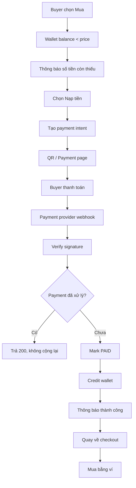

---

# FLOW-U05 — Nạp tiền qua chuyển khoản / QR

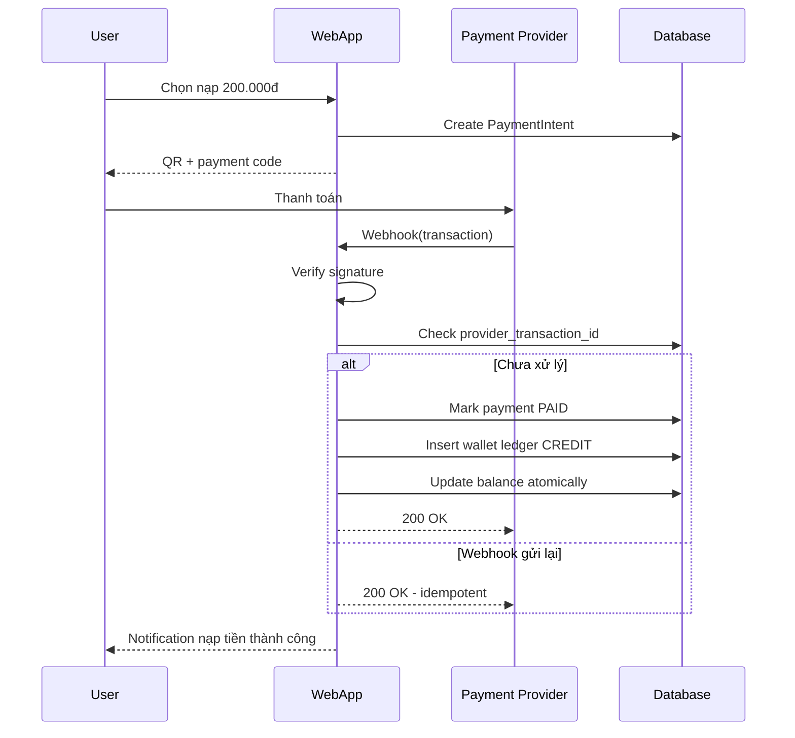

---

# FLOW-U06 — Download file đã mua

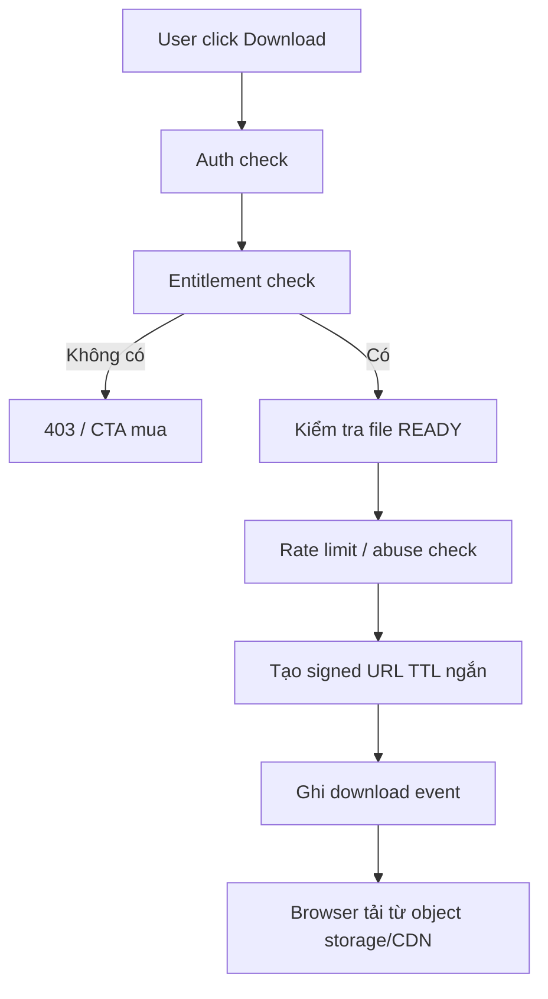

---

# FLOW-U07 — Tải file miễn phí

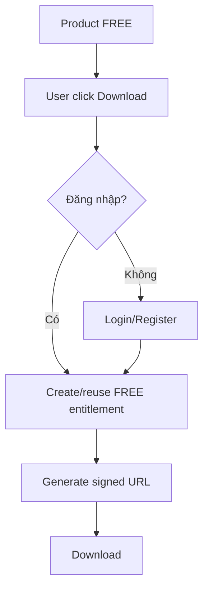

---

# FLOW-U08 — Đánh giá sau mua

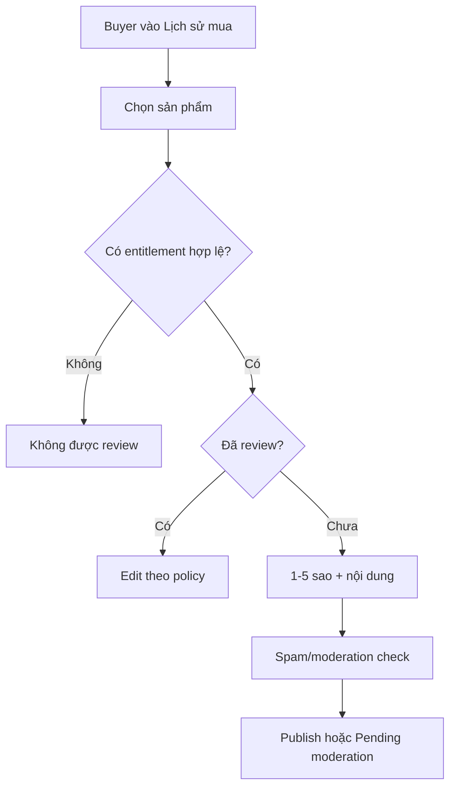

---

# FLOW-U09 — Khiếu nại file lỗi

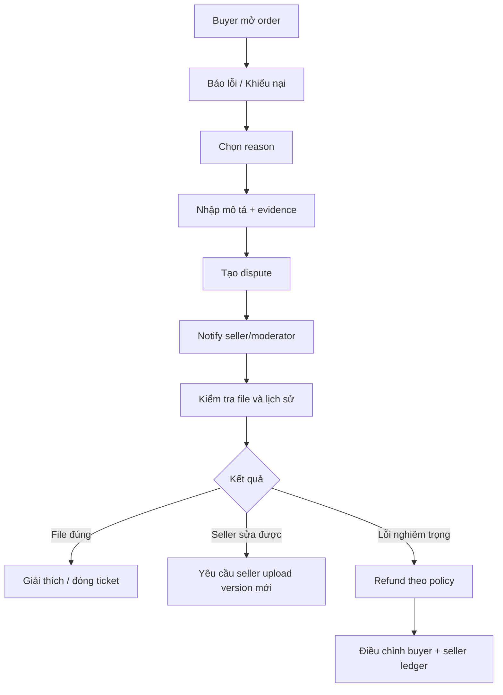

---

# FLOW-U10 — Seller đăng ký bán

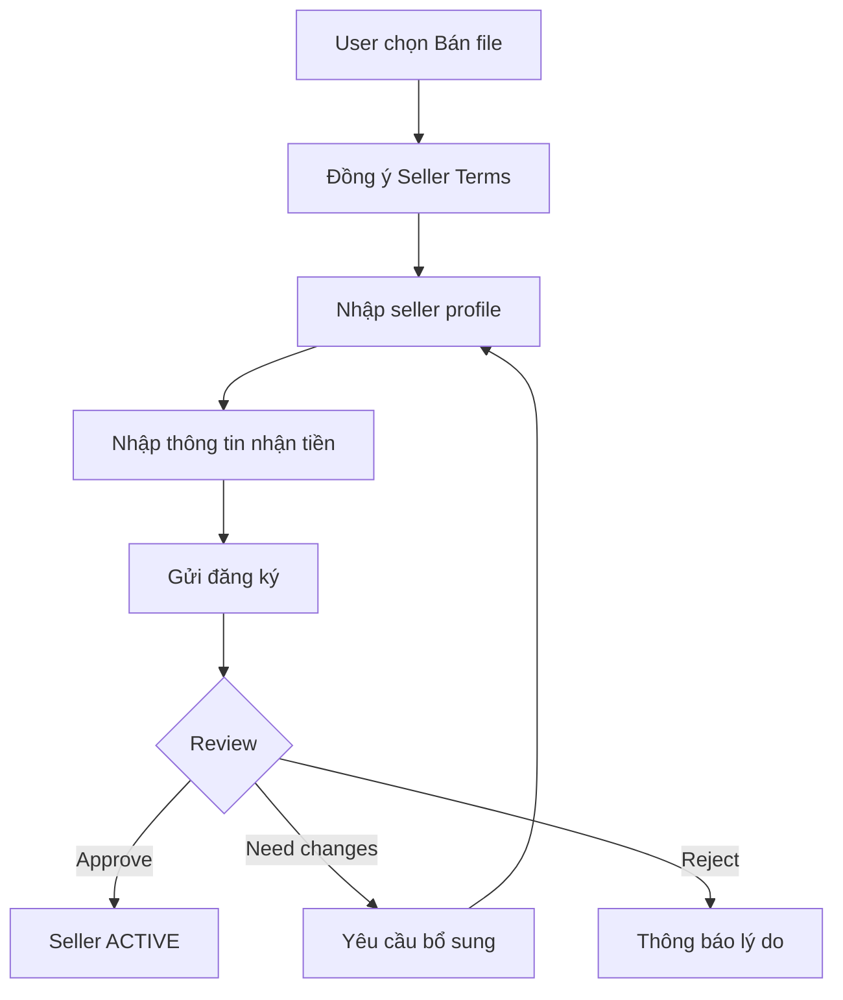

---

# FLOW-U11 — Seller đăng sản phẩm

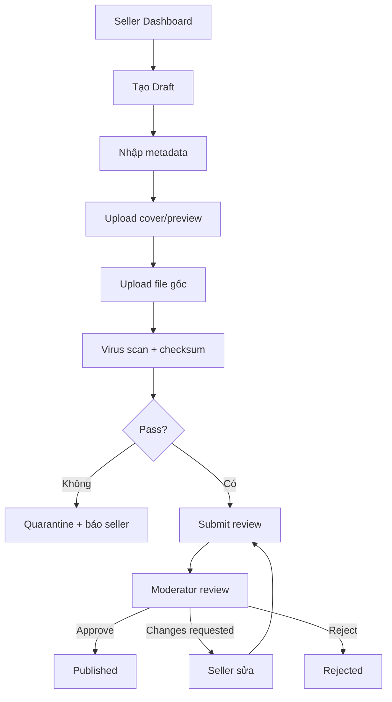

---

# FLOW-U12 — Seller phát sinh doanh thu

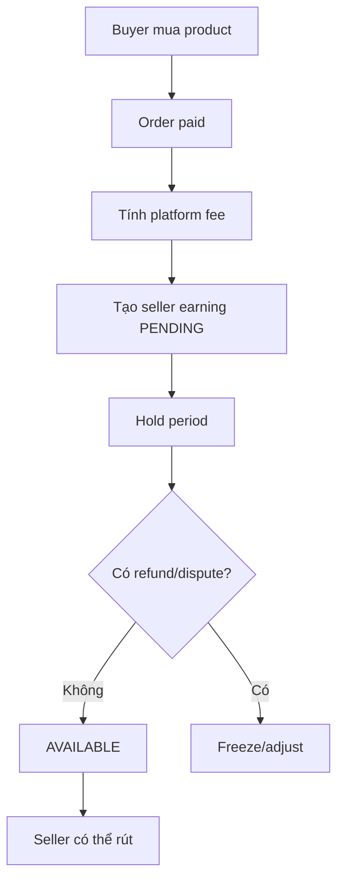

---

# FLOW-U13 — Seller rút tiền

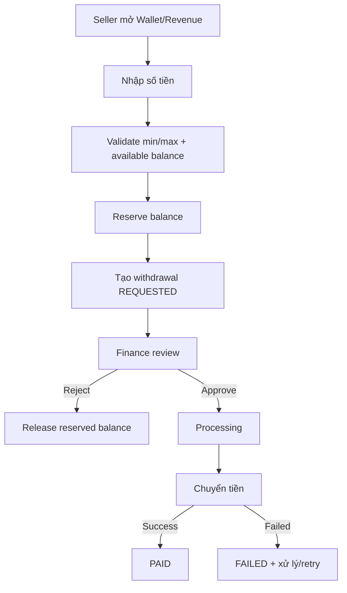

---

# FLOW-U14 — Admin duyệt sản phẩm

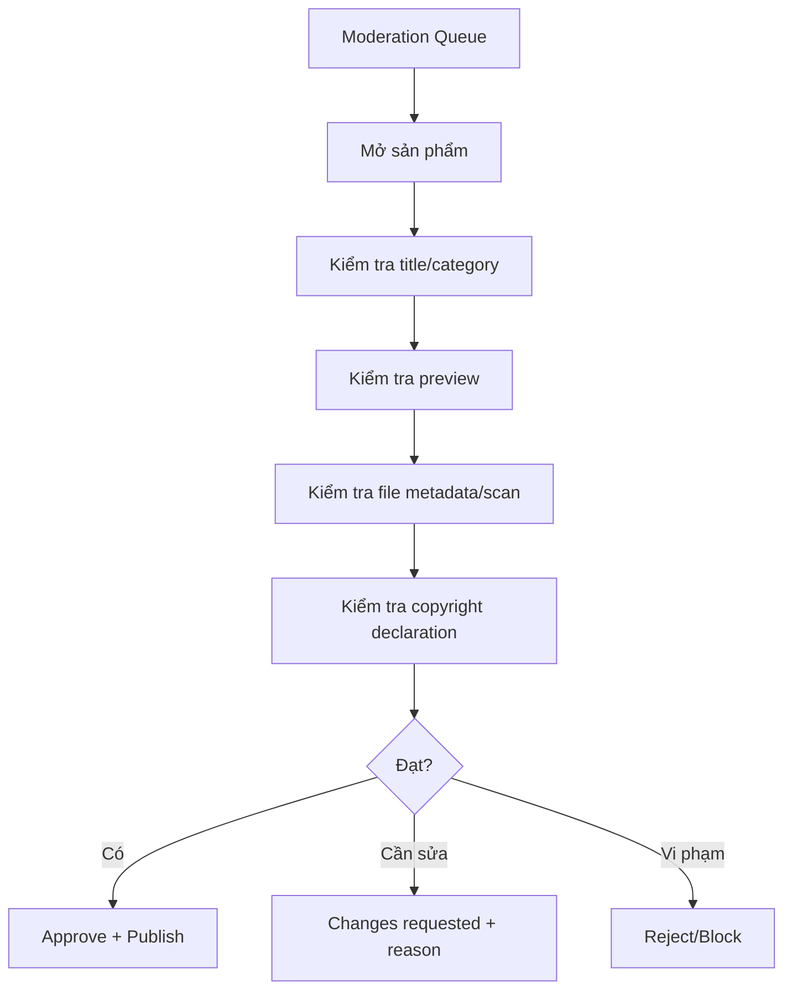

---

# FLOW-U15 — Hoàn tiền

Refund không được sửa/xóa giao dịch cũ.

```text
Original ledger entries
+
Compensating entries
=
Current financial result
```

Flow:

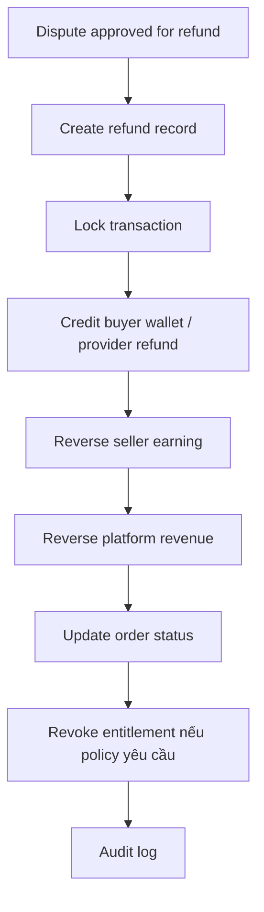

---

# 10. Business Rules quan trọng

## BR-01 — Không double-spend

Wallet debit phải thực hiện trong DB transaction và lock thích hợp.

Ví dụ logic:

```sql
UPDATE wallets
SET balance = balance - :amount
WHERE user_id = :user_id
  AND balance >= :amount;
```

Chỉ tiếp tục nếu affected rows = 1.

---

## BR-02 — Webhook idempotency

Unique constraint:

```text
(provider, provider_transaction_id)
```

Webhook bị gửi 2, 5 hoặc 20 lần cũng chỉ được cộng tiền một lần.

---

## BR-03 — Ledger bất biến

Không update/xóa ledger tài chính tùy tiện.

Nếu sai:

```text
tạo reversal / adjustment entry
```

---

## BR-04 — Seller không tự mua sản phẩm của mình

Chặn self-purchase để hạn chế:

- Fake sales.
- Fake reviews.
- Rửa promotion/commission.

---

## BR-05 — Review phải verified

Review phải gắn với:

- order item hoặc
- entitlement hợp lệ.

---

## BR-06 — File gốc private

Object storage bucket chứa file bán:

```text
PRIVATE
```

Không render public URL cố định.

---

## BR-07 — Giá tại order là snapshot

Nếu seller đổi giá sau đó, order cũ không đổi.

---

## BR-08 — Xóa sản phẩm

Không hard-delete sản phẩm đã có giao dịch.

Dùng:

```text
HIDDEN
ARCHIVED
REMOVED_FOR_POLICY
```

---

## BR-09 — Xóa user

User có giao dịch tài chính không được hard-delete tùy tiện.

Anonymize theo policy và yêu cầu pháp lý.

---

# 11. Payment Architecture

## 11.1 Entities

### payment_intents

```text
id
code
user_id
provider
amount
currency
status
expires_at
created_at
```

### payment_transactions

```text
id
payment_intent_id
provider
provider_transaction_id
amount
raw_reference
status
paid_at
created_at
```

### wallet_ledger

```text
id
wallet_id
type
amount
direction
reference_type
reference_id
balance_before
balance_after
created_at
```

---

## 11.2 Payment status

```text
CREATED
PENDING
PAID
EXPIRED
FAILED
CANCELLED
REFUNDED
```

---

## 11.3 Webhook security

Bắt buộc:

- HTTPS.
- Verify HMAC/signature theo provider.
- Timestamp validation nếu provider hỗ trợ.
- Idempotency.
- Allowlist không thay thế signature.
- Raw payload logging có masking.
- Rate limit.
- Replay protection.

---

# 12. Admin CMS

## 12.1 Dashboard

- GMV.
- Net revenue.
- Top-up amount.
- Orders.
- New users.
- Active buyers.
- Active sellers.
- Downloads.
- Top products.
- Conversion.
- Pending moderation.
- Open disputes.
- Withdrawal queue.

---

## 12.2 User Management

Admin:

- Search user.
- View profile.
- View orders.
- View wallet.
- View ledger.
- View login/security events.
- Lock/unlock.
- Suspend selling.
- Ban.
- Force logout.

Không cho admin gõ trực tiếp số balance vào một input thông thường.

Adjustment phải qua form riêng:

- amount.
- direction.
- reason.
- ticket/reference.
- approver nếu cần.

---

## 12.3 Product Management

- Search.
- Filters.
- Approve.
- Request changes.
- Reject.
- Hide.
- Feature.
- Set collection.
- Edit SEO.
- View versions.
- View audit.

---

## 12.4 Category / Taxonomy

- CRUD.
- Tree reorder.
- Software.
- Tags.
- Collections.

---

## 12.5 Payment Management

- Payment intent.
- Provider transaction.
- Webhook events.
- Failed webhook.
- Manual reconciliation.
- Export.

---

## 12.6 Seller Management

- Approve seller.
- Commission override.
- Suspend.
- View earnings.
- Withdrawal.
- Risk flags.

---

## 12.7 CMS Content

Pages:

- About.
- Terms.
- Privacy.
- Buyer guide.
- Seller guide.
- Payment guide.
- Refund policy.
- Copyright policy.
- Blog/news.

---

# 13. Notification

Channels:

### P0

- In-app.
- Email.

### P1

- Web push.
- Zalo / SMS nếu cần.

Events:

- Verify account.
- Payment success.
- Payment failed.
- Order success.
- Product approved.
- Product rejected.
- Seller sale.
- Earnings available.
- Withdrawal status.
- Ticket reply.
- Refund.
- Password/security event.

---

# 14. SEO Requirements

SEO là yêu cầu P0.

## 14.1 URL

Ví dụ:

```text
/
 /ban-ve/
 /ban-ve/nha-pho/
 /p/ban-ve-nha-pho-3-tang-abc-12345
 /phan-mem/autocad/
 /tag/nha-xuong/
 /seller/kts-nguyen-van-a/
 /bo-suu-tap/nha-pho-dep/
```

---

## 14.2 Metadata

Mỗi indexable page có:

- title.
- meta description.
- canonical.
- OG.
- Twitter card.
- structured data phù hợp.

---

## 14.3 Technical SEO

- SSR/SSG/hybrid.
- Sitemap index.
- Product sitemap.
- Category sitemap.
- Image sitemap nếu cần.
- robots.txt.
- Canonical.
- Breadcrumb.
- JSON-LD.
- Pagination strategy.
- 301 khi đổi slug.
- 404/410 đúng.
- Noindex cho search nội bộ mỏng nếu cần.
- Core Web Vitals.

---

# 15. NFR — Non-Functional Requirements

# NFR-01 — Hiệu năng

Mục tiêu production ở tải bình thường:

| Hạng mục | Mục tiêu |
|---|---:|
| API read p50 | < 100 ms |
| API read p95 | < 300 ms |
| API read p99 | < 700 ms |
| API write p95 | < 500 ms |
| Search p95 | < 500 ms |
| LCP mobile | < 2.5 s |
| INP | < 200 ms |
| CLS | < 0.1 |
| TTFB cached page | < 300 ms |

Không tính thời gian upload/download file lớn từ object storage.

---

# NFR-02 — Availability

MVP:

```text
99.9% monthly target
```

Không để lỗi search hoặc recommendation làm chết checkout/download.

Cần graceful degradation.

---

# NFR-03 — Scalability

Thiết kế để có thể mở rộng tới:

- 1M+ products metadata.
- 10M+ preview assets.
- TB–PB storage theo thời gian.
- Hàng nghìn concurrent users.
- Worker scale ngang.
- CDN scale độc lập.

Không cần triển khai mức này ở ngày đầu, nhưng schema và kiến trúc không được khóa đường scale.

---

# NFR-04 — Security

Áp dụng tối thiểu:

- OWASP Top 10.
- HTTPS everywhere.
- Secure cookies.
- CSRF protection khi cần.
- CSP.
- XSS prevention.
- SQL injection prevention.
- Strong password hashing: Argon2id/bcrypt.
- Rate limit.
- Brute-force protection.
- MFA cho Admin P1.
- RBAC.
- Least privilege.
- Signed URLs.
- Private storage.
- Webhook HMAC verification.
- Secrets manager.
- Dependency scanning.
- Container scanning.
- Audit logs.
- Security headers.

---

# NFR-05 — Financial Integrity

Các thao tác ảnh hưởng tiền:

- Atomic.
- Idempotent.
- Auditable.
- Reversible bằng compensating entry.
- Không phụ thuộc event eventual-consistency để xác định số dư khả dụng tại checkout.

Có daily reconciliation job.

---

# NFR-06 — Data Integrity

- Foreign keys khi hợp lý.
- Unique constraints.
- Check constraints.
- Transaction cho critical workflow.
- Soft delete cho entity nghiệp vụ cần lịch sử.
- Migration có version.

---

# NFR-07 — Backup / Disaster Recovery

Mục tiêu ban đầu:

```text
RPO <= 15 phút cho database
RTO <= 2 giờ
```

Bắt buộc:

- Automated DB backup.
- PITR nếu provider hỗ trợ.
- Object storage versioning.
- Backup encryption.
- Restore drill định kỳ.

Backup chưa được test restore thì chưa được coi là backup hoàn chỉnh.

---

# NFR-08 — Observability

Có:

- Structured logs.
- Metrics.
- Traces.
- Error tracking.
- Request ID.
- User/session correlation an toàn.
- Payment event logs.
- Worker metrics.

Alert:

- 5xx spike.
- DB saturation.
- Queue lag.
- Payment webhook failures.
- Storage failures.
- Elevated download failures.
- Disk/CPU/memory.
- Backup failure.

---

# NFR-09 — Privacy

- Chỉ thu thập dữ liệu cần thiết.
- Mask dữ liệu nhạy cảm trong logs.
- Phân quyền xem thông tin ngân hàng.
- Retention policy.
- Export/delete/anonymize theo policy và luật áp dụng.
- Không lưu thông tin payment card nếu không cần.

---

# NFR-10 — Accessibility

Mục tiêu:

```text
WCAG 2.2 AA cho luồng chính
```

Ít nhất:

- Keyboard.
- Focus state.
- Label.
- Contrast.
- Alt text.
- Error message rõ ràng.
- Semantic HTML.

---

# NFR-11 — Compatibility

Hỗ trợ:

- Chrome hiện hành và 2 phiên bản gần nhất.
- Edge.
- Firefox.
- Safari.
- Android browser phổ biến.
- iOS Safari.

Responsive từ:

```text
360px → desktop lớn
```

---

# NFR-12 — Maintainability

- Modular codebase.
- Coding conventions.
- API contract.
- Automated tests.
- Migration discipline.
- ADR cho quyết định kiến trúc quan trọng.
- Không đặt business logic tài chính trong controller/UI.

---

# NFR-13 — Testability

Coverage không phải chỉ tiêu duy nhất.

Critical flows bắt buộc có automated integration test:

- Top-up webhook.
- Duplicate webhook.
- Purchase.
- Insufficient balance.
- Concurrent purchase.
- Refund.
- Seller earning.
- Withdrawal.
- Entitlement.
- Secure download.

---

# NFR-14 — Auditability

Audit log cho:

- Admin role change.
- User ban.
- Balance adjustment.
- Product moderation.
- Refund.
- Withdrawal.
- Commission change.
- System setting.
- Entitlement revoke.
- File version replacement.

Log:

```text
actor
action
resource
before
after
reason
ip
timestamp
request_id
```

---

# NFR-15 — SEO Performance

- SSR/SSG cho landing page cần index.
- HTML có nội dung khi bot truy cập.
- Không phụ thuộc client JS để Google mới nhìn thấy title/product description.
- Sitemap tự cập nhật.
- Cache tốt.

---

# NFR-16 — File Durability

Object storage phải có durability cao.

Khuyến nghị:

- Versioning.
- Lifecycle.
- Checksum.
- Multipart upload.
- Retry.
- Không lưu file lớn trên local disk app server.

---

# NFR-17 — Abuse Protection

- Login rate limit.
- Search rate limit hợp lý.
- Download rate limit.
- Upload quota.
- CAPTCHA risk-based.
- Spam review detection.
- Duplicate content detection P1.
- Suspicious account signals.

---

# NFR-18 — Localization

MVP:

```text
vi-VN
VND
Asia/Ho_Chi_Minh
```

Database timestamp lưu UTC.

UI convert về timezone phù hợp.

Kiến trúc sẵn sàng i18n.

---

# NFR-19 — Legal / Content Compliance

Phải có:

- Terms.
- Privacy.
- Copyright policy.
- Takedown flow.
- Seller declaration.
- Prohibited content policy.
- Refund policy.
- Contact/support.

Admin có công cụ:

- Takedown.
- Freeze seller earnings.
- Preserve evidence/log.

---

# 16. Kiến trúc đề xuất

Ưu tiên hiệu năng và khả năng kiểm soát.

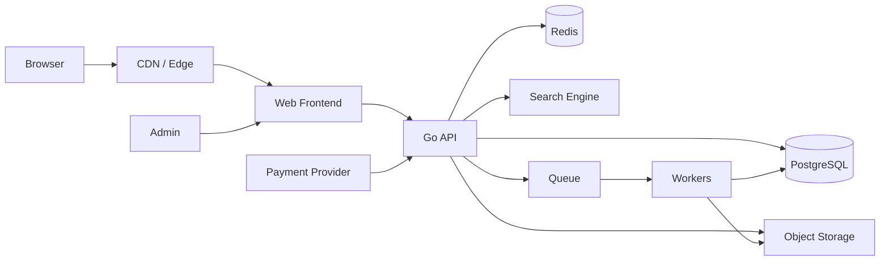

---

## 16.1 Frontend

Đề xuất:

- Next.js.
- TypeScript.
- SSR / SSG / ISR.
- Tailwind hoặc design system tương đương.

Lý do:

- SEO.
- Routing tốt.
- Ecosystem mạnh.
- Hybrid rendering.

---

## 16.2 Backend

Đề xuất:

**Go**

Framework có thể:

- net/http + chi.
- Fiber.
- Echo.
- Gin.

Khuyến nghị ưu tiên:

```text
Go + chi/net-http
```

để giảm abstraction không cần thiết.

Backend chịu:

- Auth.
- Catalog API.
- Wallet.
- Orders.
- Payment.
- Seller.
- Download authorization.
- Admin APIs.

---

## 16.3 Database

**PostgreSQL**

Dùng cho:

- Users.
- Products.
- Orders.
- Wallet.
- Ledger.
- Seller earnings.
- Withdrawals.
- Reviews.
- Moderation.
- Audit.

---

## 16.4 Redis

Dùng cho:

- Cache.
- Rate limits.
- Distributed locks khi thực sự cần.
- Sessions nếu kiến trúc dùng session.
- Short-lived data.

Không coi Redis là source of truth cho tiền.

---

## 16.5 Search Engine

Giai đoạn đầu:

- PostgreSQL full-text nếu catalog nhỏ.

Khi cần:

- Meilisearch / Typesense / OpenSearch.

Search index không phải source of truth.

---

## 16.6 Object Storage

S3-compatible:

- AWS S3.
- Cloudflare R2.
- MinIO.
- Provider tương đương.

Buckets tách:

```text
public-previews
private-products
quarantine
```

---

## 16.7 Queue / Worker

Job:

- Image processing.
- File scan.
- Search indexing.
- Email.
- Sitemap generation.
- Earnings release.
- Analytics aggregation.
- Cleanup.
- Reconciliation.

Có thể bắt đầu:

- Redis-backed queue.

Scale sau:

- RabbitMQ / NATS / Kafka tùy nhu cầu thực tế.

---

# 17. Database Model sơ bộ

Core tables:

```text
users
user_profiles
roles
permissions
user_roles

seller_profiles
seller_bank_accounts

categories
software_types
tags
products
product_tags
product_versions
product_files
product_previews

favorites

wallets
wallet_ledger

payment_intents
payment_transactions
payment_webhook_events

orders
order_items
entitlements
download_events

seller_earnings
withdrawals
withdrawal_events

reviews
comments

support_tickets
ticket_messages
disputes
refunds

notifications

moderation_cases
moderation_actions

cms_pages
collections
collection_items

audit_logs
system_settings
```

---

# 18. API sơ bộ

Public:

```text
GET  /api/v1/products
GET  /api/v1/products/{slug}
GET  /api/v1/categories
GET  /api/v1/search
GET  /api/v1/sellers/{slug}
```

Auth:

```text
POST /api/v1/auth/register
POST /api/v1/auth/login
POST /api/v1/auth/logout
POST /api/v1/auth/forgot-password
POST /api/v1/auth/reset-password
```

Buyer:

```text
GET  /api/v1/me
GET  /api/v1/me/wallet
GET  /api/v1/me/wallet/ledger
POST /api/v1/payments/topup
GET  /api/v1/orders
POST /api/v1/orders/purchase
POST /api/v1/downloads/{productId}
POST /api/v1/favorites/{productId}
POST /api/v1/reviews
POST /api/v1/tickets
```

Seller:

```text
POST /api/v1/seller/apply
GET  /api/v1/seller/dashboard
GET  /api/v1/seller/products
POST /api/v1/seller/products
PUT  /api/v1/seller/products/{id}
POST /api/v1/seller/products/{id}/submit
POST /api/v1/seller/uploads
GET  /api/v1/seller/earnings
POST /api/v1/seller/withdrawals
```

Payment:

```text
POST /api/v1/webhooks/payments/{provider}
```

Admin:

```text
GET  /api/v1/admin/users
GET  /api/v1/admin/products
POST /api/v1/admin/products/{id}/approve
POST /api/v1/admin/products/{id}/request-changes
POST /api/v1/admin/products/{id}/reject
GET  /api/v1/admin/payments
GET  /api/v1/admin/withdrawals
POST /api/v1/admin/withdrawals/{id}/approve
POST /api/v1/admin/refunds
```

---

# 19. Cache Strategy

Cache được phép cho:

- Category.
- Product public detail.
- Homepage sections.
- Related products.
- Search suggestions.

Không cache mù:

- Wallet balance.
- Entitlement authorization.
- Withdrawal available balance.

Invalidation event:

```text
PRODUCT_UPDATED
PRODUCT_PUBLISHED
PRODUCT_HIDDEN
CATEGORY_UPDATED
```

---

# 20. Upload Pipeline

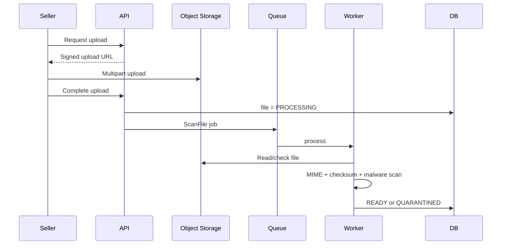

---

# 21. Payment Failure Scenarios

Phải thiết kế test cho:

### Case 1

Webhook gửi trùng.

Kết quả:

```text
Không cộng tiền lần 2.
```

### Case 2

User đóng trình duyệt sau khi thanh toán.

Kết quả:

```text
Webhook vẫn ghi nhận payment.
```

### Case 3

Webhook tới trước redirect.

Kết quả:

```text
Payment đúng.
```

### Case 4

Redirect success nhưng webhook chưa tới.

Kết quả:

```text
UI hiển thị Processing, không tự cộng tiền.
```

### Case 5

Sai amount.

Kết quả:

```text
Flag reconciliation/manual review.
```

### Case 6

Sai signature.

Kết quả:

```text
Reject.
```

### Case 7

DB lỗi sau khi nhận webhook.

Kết quả:

```text
Transaction rollback, provider retry webhook hoặc reconciliation xử lý.
```

---

# 22. Authorization Matrix

| Action | Guest | Buyer | Seller | Moderator | Finance | Admin |
|---|---:|---:|---:|---:|---:|---:|
| View product | ✅ | ✅ | ✅ | ✅ | ✅ | ✅ |
| Purchase | ❌ | ✅ | ✅ | ✅ | ✅ | ✅ |
| Download owned | ❌ | ✅ | ✅ | ✅ | ✅ | ✅ |
| Create product | ❌ | ❌ | ✅ | ❌ | ❌ | ✅ |
| Review product | ❌ | ✅* | ✅* | ✅* | ✅* | ✅ |
| Moderate product | ❌ | ❌ | ❌ | ✅ | ❌ | ✅ |
| View finance ledger | ❌ | own | own | ❌ | ✅ | ✅ |
| Approve withdrawal | ❌ | ❌ | ❌ | ❌ | ✅ | ✅ |
| Balance adjustment | ❌ | ❌ | ❌ | ❌ | restricted | ✅ |
| Manage roles | ❌ | ❌ | ❌ | ❌ | ❌ | ✅ |

`*` chỉ khi có quyền sở hữu/mua hợp lệ theo policy.

---

# 23. Analytics

Track event:

```text
page_view
search
search_no_result
product_view
preview_view
favorite
checkout_started
topup_started
topup_success
purchase_success
download_started
download_success
download_failed
review_created
seller_product_submitted
seller_product_approved
withdrawal_requested
```

Funnel:

```text
Search
→ Product View
→ Checkout
→ Top-up
→ Purchase
→ Download
```

Seller funnel:

```text
Seller Apply
→ Approved
→ First Product Submitted
→ First Product Published
→ First Sale
→ First Withdrawal
```

---

# 24. Admin Reports

Cần báo cáo:

- GMV theo ngày/tháng.
- Platform revenue.
- Wallet deposits.
- Outstanding wallet liability.
- Seller payable.
- Withdrawals.
- Refunds.
- Active users.
- New sellers.
- Top categories.
- Top products.
- Search keywords.
- No-result search.
- Conversion.
- Download failure rate.
- Payment success rate.

---

# 25. UI / Screens

## Public

1. Homepage.
2. Category.
3. Search.
4. Product detail.
5. Seller profile.
6. Collection.
7. Blog.
8. CMS page.
9. Login.
10. Register.
11. Forgot password.

## Buyer

12. Dashboard.
13. Wallet.
14. Top-up.
15. Payment status.
16. Orders.
17. Purchased files.
18. Favorites.
19. Reviews.
20. Tickets.
21. Notifications.
22. Account settings.

## Seller

23. Seller onboarding.
24. Seller dashboard.
25. Product list.
26. Product editor.
27. Upload manager.
28. Revenue.
29. Orders/sales.
30. Withdrawal.
31. Seller analytics.
32. Seller settings.

## Admin

33. Admin dashboard.
34. Moderation queue.
35. Product management.
36. User management.
37. Seller management.
38. Orders.
39. Payments.
40. Ledger.
41. Withdrawals.
42. Refunds.
43. Tickets/disputes.
44. Category management.
45. CMS.
46. Collections.
47. SEO.
48. Reports.
49. Audit logs.
50. System settings.

---

# 26. MVP Priority

## P0 — Bắt buộc launch

- Auth.
- Categories.
- Product catalog.
- Search cơ bản.
- Product detail.
- Preview.
- Seller.
- Product upload.
- Moderation.
- Wallet.
- Top-up.
- Payment webhook.
- Purchase.
- Entitlement.
- Secure download.
- Orders.
- Seller earning.
- Withdrawal manual approval.
- Review.
- Admin.
- SEO cơ bản.
- Email.
- Audit.
- Logs/monitoring.
- Backup.

---

## P1 — Ngay sau MVP

- Direct payment.
- Coupon.
- Advanced search engine.
- Collections.
- Product versioning UI hoàn chỉnh.
- Web push.
- Seller analytics nâng cao.
- Automated payout.
- Better fraud detection.
- Watermark engine.
- Related recommendation.

---

## P2 — Scale

- Personal recommendations.
- Subscription.
- Organization account.
- API for partners.
- International payment.
- Multi-currency.
- Multi-language.
- Search personalization.
- AI-assisted tagging.
- AI duplicate detection.
- CAD metadata extraction.
- Preview generation chuyên sâu.

---

# 27. Roadmap triển khai

## Phase 0 — Product Definition

Deliverables:

- PLAN.md.
- Business rules.
- Wireframe.
- ERD.
- API conventions.
- Design system.
- ADR kiến trúc.
- Threat model sơ bộ.

Exit criteria:

- P0 scope được khóa.
- State machine tài chính được duyệt.
- Payment provider được chọn.

---

## Phase 1 — Foundation

Xây:

- Repository.
- CI.
- Environments.
- PostgreSQL.
- Redis.
- Object storage.
- Auth.
- RBAC.
- User.
- Base admin.
- Observability.

Exit criteria:

- Dev/staging deploy tự động.
- Auth/RBAC test pass.
- Logs/metrics hoạt động.

---

## Phase 2 — Catalog

Xây:

- Category.
- Product.
- Seller profile.
- Preview.
- Search cơ bản.
- Product page.
- SEO.
- Sitemap.

Exit criteria:

- Guest có thể tìm và xem sản phẩm hoàn chỉnh.
- Googlebot nhận HTML indexable.

---

## Phase 3 — Seller & Moderation

Xây:

- Seller onboarding.
- Product editor.
- Upload.
- Scan.
- Submit.
- Moderation.
- Publish.

Exit criteria:

- Seller có thể tạo → upload → submit → admin approve → public.

---

## Phase 4 — Payment & Wallet

Xây:

- Wallet.
- Ledger.
- Top-up.
- Provider integration.
- HMAC webhook.
- Idempotency.
- Reconciliation.

Exit criteria:

- Duplicate webhook test pass.
- Failure recovery test pass.
- Ledger invariant test pass.

---

## Phase 5 — Purchase & Download

Xây:

- Order.
- Purchase.
- Entitlement.
- Secure download.
- Purchase history.
- Free download.

Exit criteria:

```text
Top-up → Buy → Download
```

hoạt động end-to-end trên staging.

---

## Phase 6 — Seller Revenue

Xây:

- Commission.
- Seller earnings.
- Hold period.
- Withdrawal.
- Finance admin.
- Refund.

Exit criteria:

```text
Buyer purchase
→ seller pending
→ available
→ withdrawal
```

được test đầy đủ.

---

## Phase 7 — Community & Support

- Review.
- Comments.
- Tickets.
- Reports.
- Disputes.
- Notifications.

---

## Phase 8 — Hardening

- Load testing.
- Security testing.
- Backup restore test.
- SEO audit.
- Accessibility.
- Payment reconciliation.
- Monitoring alerts.
- Disaster runbook.
- Admin runbook.

---

## Phase 9 — Launch

Checklist:

- Production domain.
- TLS.
- CDN.
- WAF.
- Backups.
- Alerts.
- Payment production credentials.
- Email reputation.
- Terms.
- Privacy.
- Refund.
- Copyright policy.
- Support channel.
- Analytics.
- Search Console.
- Sitemap.
- Robots.
- Error pages.
- Incident contacts.

---

# 28. Definition of Done cho mỗi feature

Feature chỉ Done khi:

1. Code hoàn thành.
2. Unit/integration test phù hợp.
3. Authorization test.
4. Error handling.
5. Logs.
6. Metrics nếu quan trọng.
7. Audit nếu ảnh hưởng tiền/quyền.
8. Responsive.
9. Accessibility cơ bản.
10. Documentation.
11. Staging QA.
12. Không có critical/high security issue chưa xử lý.

---

# 29. Test Plan bắt buộc

## Auth

- Login đúng/sai.
- Brute force.
- Reset token expiry.
- Session revoke.

## Wallet

- Credit.
- Debit.
- Insufficient balance.
- Concurrent debit.
- Adjustment.
- Ledger consistency.

## Payment

- Valid webhook.
- Invalid HMAC.
- Duplicate webhook.
- Wrong amount.
- Delayed webhook.
- Out-of-order events.

## Order

- Purchase success.
- Double click.
- Product hidden between checkout.
- Price changed between page load/purchase.
- Seller self purchase.

## Download

- No entitlement.
- Valid entitlement.
- Expired signed URL.
- Deleted/blocked file.
- Rate limit.
- Download logging.

## Seller

- Submit incomplete product.
- Malware file.
- Moderator reject.
- Re-submit.
- Product version replacement.

## Withdrawal

- Amount > available.
- Concurrent requests.
- Reject.
- Approve.
- Payout failure.
- Retry.

## Refund

- Full refund.
- Duplicate refund.
- Seller pending.
- Seller already available.
- Entitlement behavior.

---

# 30. SLO / Monitoring Dashboard

Dashboard production tối thiểu:

```text
Request rate
Error rate
Latency p50/p95/p99
CPU
Memory
DB connections
DB slow queries
Redis latency
Queue depth
Queue lag
Search latency
Payment webhook success
Payment processing latency
Purchase success rate
Download success rate
Object storage errors
Email queue
Backup status
```

---

# 31. Performance Test Scenario

## Scenario A — Browse

- 1.000 concurrent virtual users.
- Browse category.
- Search.
- Product detail.

Mục tiêu:

- p95 API < 500ms trong test target.
- error < 1%.

## Scenario B — Purchase burst

Nhiều buyer mua đồng thời.

Kiểm chứng:

- Không âm balance.
- Không double debit.
- Không duplicate entitlement ngoài policy.
- Ledger cân.

## Scenario C — Webhook burst

Provider gửi nhiều webhook đồng thời + duplicate.

Kiểm chứng:

- Exactly-once business effect.
- At-least-once delivery vẫn an toàn.

---

# 32. Security Threats cần xử lý

1. Đoán URL để tải file gốc.
2. Chia sẻ signed URL.
3. Credential stuffing.
4. Fake payment webhook.
5. Replay webhook.
6. Double-spend wallet.
7. Race condition withdrawal.
8. Seller upload malware.
9. Stored XSS trong description/comment.
10. IDOR xem order user khác.
11. Admin privilege escalation.
12. Spam product.
13. Copyright abuse.
14. Scraping catalogue.
15. Bot download.
16. CSRF.
17. SSRF qua URL import nếu sau này hỗ trợ import.
18. Zip bomb.
19. MIME spoofing.
20. Large upload resource exhaustion.

---

# 33. Coding / Architecture Rules

1. Controller không chứa financial business logic.
2. Domain service xử lý purchase.
3. Repository/database layer rõ ràng.
4. Money dùng integer.
5. Time dùng UTC trong database.
6. ID ưu tiên UUID/ULID cho public resource.
7. Mã order/payment riêng để hỗ trợ support.
8. API versioned.
9. Error response thống nhất.
10. Không log password/token/full sensitive payload.
11. Migration forward/backward có kế hoạch.
12. Config qua environment/secrets.
13. Không hard-code provider/payment key.
14. File service tách khỏi product metadata.
15. Event async không thay thế transaction cần strong consistency.

---

# 34. Repository đề xuất

Có thể dùng monorepo:

```text
/apps
  /web
  /api
  /worker

/packages
  /ui
  /contracts

/infra
  /docker
  /terraform

/docs
  /adr
  /api
  /runbooks

PLAN.md
README.md
```

Hoặc Go backend riêng repo nếu team muốn lifecycle độc lập.

---

# 35. Environment

```text
local
staging
production
```

Không dùng production credentials ở local/staging.

Payment staging phải có:

- Test provider hoặc sandbox.
- Webhook simulator.
- Replay fixtures.

---

# 36. CI/CD

Pull request:

```text
lint
unit test
integration test
security/dependency scan
build
```

Merge main:

```text
build immutable image
deploy staging
migration
smoke test
```

Production:

- Manual approval hoặc protected release.
- Migration safety check.
- Rollback strategy.
- Health checks.

---

# 37. Migration Strategy

DB migration phải:

- Có version.
- Không phá backward compatibility trong rolling deploy nếu có nhiều instance.
- Large migration phải online-safe.

Không:

```text
drop column ngay cùng release với việc bỏ code
```

Khuyến nghị:

```text
expand
→ migrate
→ switch
→ contract
```

---

# 38. Feature Flags

Dùng cho:

- New payment provider.
- Direct payment.
- New checkout.
- New search.
- Automated payout.
- Review moderation.

Có kill switch cho:

- Purchase.
- Top-up provider.
- Withdrawal.
- Upload.

---

# 39. Rủi ro dự án

## R1 — Giao dịch tiền sai

Mức: Critical.

Giảm thiểu:

- Ledger.
- DB transaction.
- Idempotency.
- Reconciliation.
- Audit.
- Tests.

## R2 — File bị chia sẻ trái phép

Không thể triệt tiêu hoàn toàn với file số.

Giảm thiểu:

- Signed URL.
- Rate limit.
- Watermark preview.
- Abuse detection.
- Legal policy.
- Optional buyer watermarking cho PDF ở P2.

## R3 — Seller upload nội dung bản quyền

Giảm thiểu:

- Declaration.
- Moderation.
- Takedown.
- Seller strike.
- Freeze payout khi dispute nghiêm trọng.

## R4 — SEO bị duplicate/thin pages

Giảm thiểu:

- Canonical.
- Index policy.
- Quality thresholds.
- Sitemap control.
- Unique metadata/content.

## R5 — Catalog lớn làm search/DB chậm

Giảm thiểu:

- Index.
- Cache.
- Search engine.
- Query monitoring.
- Read model khi cần.

---

# 40. KPI sau launch

Business:

- MAU.
- Buyer conversion.
- GMV.
- Platform revenue.
- Average order value.
- Repeat purchase rate.
- Seller activation.
- Products published/week.
- Refund rate.

Product:

- Search → product CTR.
- Product → purchase conversion.
- Top-up completion.
- Download success.
- Review rate.

Technical:

- p95 latency.
- error rate.
- payment failure.
- webhook processing delay.
- download failure.
- uptime.

---

# 41. MVP Acceptance Criteria tổng

MVP được coi là sẵn sàng khi một người dùng mới có thể:

```text
1. Vào Google/website.
2. Tìm một bản vẽ.
3. Xem chi tiết và preview.
4. Đăng ký.
5. Nạp tiền.
6. Hệ thống tự nhận payment.
7. Mua bản vẽ.
8. Nhận quyền tải.
9. Tải file.
10. Quay lại sau và tải lại.
11. Đánh giá.
```

Và một seller mới có thể:

```text
1. Đăng ký seller.
2. Tạo sản phẩm.
3. Upload preview.
4. Upload file gốc.
5. Submit.
6. Admin duyệt.
7. Product được public.
8. Có buyer mua.
9. Seller thấy earning.
10. Earning chuyển available.
11. Seller yêu cầu rút.
12. Finance xử lý payout.
```

Admin phải có thể truy vết toàn bộ chuỗi trên qua:

```text
user
payment
ledger
order
entitlement
download
earning
withdrawal
audit log
```

---

# 42. Những điều KHÔNG được làm

1. Không public file gốc bằng URL tĩnh.
2. Không dùng floating point cho tiền.
3. Không chỉ lưu `wallet.balance` mà không có ledger.
4. Không tin redirect từ payment provider là bằng chứng thanh toán.
5. Không xử lý webhook mà thiếu idempotency.
6. Không cho admin sửa balance mà không audit.
7. Không hard-delete order/payment/ledger.
8. Không cho seller tự publish nếu marketplace yêu cầu moderation.
9. Không nhét toàn bộ frontend + backend + worker vào một process buộc phải scale cùng nhau.
10. Không render toàn bộ catalog chỉ bằng client-side JS nếu SEO là kênh chính.
11. Không lưu file upload lớn vào database.
12. Không chạy xử lý ảnh/scan file nặng đồng bộ trong request web.

---

# 43. Quyết định kỹ thuật đề xuất cho phiên bản đầu

```yaml
product_name: KienTaoHub

frontend:
  framework: Next.js
  language: TypeScript

backend:
  language: Go
  style: Modular Monolith
  api: REST

database:
  primary: PostgreSQL

cache:
  engine: Redis

storage:
  type: S3-compatible object storage

search:
  mvp: PostgreSQL FTS
  scale: Meilisearch/Typesense/OpenSearch

async:
  type: Queue + Go workers

payments:
  pattern: Provider adapters + webhook
  required:
    - HMAC/signature verification
    - idempotency
    - reconciliation

deployment:
  container: Docker
  edge: CDN
```

### Vì sao Modular Monolith trước?

Không cần microservices ngay.

Các domain vẫn tách module:

```text
auth
catalog
seller
payment
wallet
order
download
review
support
admin
```

Khi scale, có thể tách:

```text
search
worker
payment
file-processing
notification
```

mà không phải viết microservice từ ngày đầu.

---

# 44. Thứ tự build khuyến nghị

Không build theo thứ tự giao diện.

Build theo dependency:

```text
1. Auth/RBAC
2. Catalog
3. Seller
4. Storage/upload
5. Moderation
6. Wallet/Ledger
7. Payment
8. Order
9. Entitlement
10. Download
11. Seller earning
12. Withdrawal
13. Refund/dispute
14. Review/community
15. SEO optimization
16. Analytics
17. Hardening
```

Đặc biệt:

```text
Ledger + Payment + Order + Entitlement
```

phải được thiết kế trước khi làm button "Mua ngay".

---

# 45. Backlog gợi ý theo Epic

```text
EPIC-001 Identity & Access
EPIC-002 Catalog & Taxonomy
EPIC-003 Search
EPIC-004 Product Detail & Preview
EPIC-005 Seller Onboarding
EPIC-006 Upload & File Processing
EPIC-007 Moderation
EPIC-008 Wallet & Ledger
EPIC-009 Payment Integration
EPIC-010 Checkout & Order
EPIC-011 Entitlement & Download
EPIC-012 Seller Earnings
EPIC-013 Withdrawal
EPIC-014 Refund & Dispute
EPIC-015 Review & Comments
EPIC-016 Notification
EPIC-017 Admin
EPIC-018 SEO
EPIC-019 Analytics
EPIC-020 Security & Observability
EPIC-021 Backup & Disaster Recovery
```

---

# 46. Nguồn tham khảo nghiệp vụ

Tài liệu này không sao chép giao diện hay code của website tham khảo. Việc khảo sát chỉ nhằm nhận diện các pattern nghiệp vụ phổ biến của marketplace bản vẽ như:

- catalog bản vẽ;
- file miễn phí / có phí;
- trang chi tiết có preview;
- nạp tiền và tải file;
- người bán đăng sản phẩm;
- chia sẻ doanh thu;
- rút tiền;
- đánh giá;
- sản phẩm liên quan.

Các trang được khảo sát trong quá trình lập kế hoạch:

- https://khobanve.vn/
- https://khobanve.vn/top-ban-ve.htm
- https://khobanve.vn/chinh-sach-ban-ban-ve.htm
- https://khobanve.vn/danh-cho-nguoi-mua/huong-dan-tai-ban-ve-co-phi-tren-khobanvevn-16.htm

---

# 47. Kết luận

KienTaoHub nên được xây như một **marketplace giao dịch file số có financial ledger và entitlement**, không nên xây như một CMS đơn thuần.

Ba trụ cột quan trọng nhất:

```text
1. Catalog + SEO
2. Payment + Financial Integrity
3. Secure File Delivery + Seller Marketplace
```

Nếu ba phần này đúng ngay từ kiến trúc đầu tiên, các tính năng như coupon, recommendation, subscription, AI tagging hoặc mobile app có thể bổ sung sau mà không phải viết lại lõi hệ thống.
